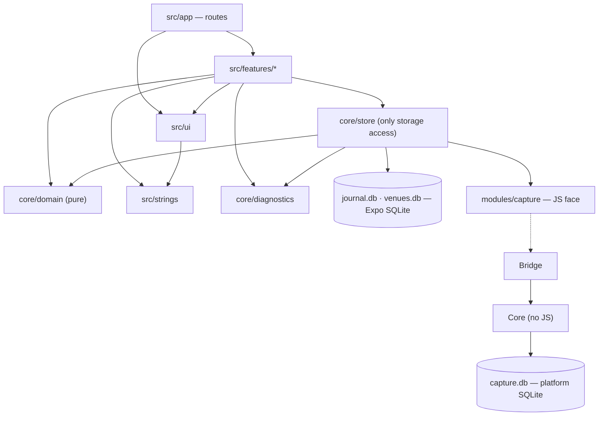

# ADR-0001 — Code architecture: feature folders on a small shared core, strictly enforced (B-strict)

**Status:** **Adopted** — CEO, 2026-10-02, **D64** (`decisions/2026-09-16-haunt-gate.md`), deciding SPK-20 under D59.
**Date:** 2026-10-02 · **Deciders:** CEO (decision); CTO (proposal and this record) · **Ticket:** SPK-20 (FT-PLAN-6, M0) · **Supersedes:** the draft at `architecture-proposals.md` §10.
**Reviews behind it:** Engineer, as the non-author seat (`reviews/engineer-review.md`, agrees with B); CSO, security (`reviews/cso-review.md`, B preferred, conditions C1–C23); Engineer's SQLite investigation (`sqlite-two-copies-investigation.md`), adopted as **D63**.
**Evidence:** every [E] claim here is retrieved and linked in `architecture-proposals.md` §11 (E1–E33) and its addendum §A.5 (A1–A16). Tags follow `pipeline/evidence-standard.md`.
**Binding on:** all product code in `deopea-david/haunts`. A ticket whose files contradict this record is a spec defect, not a licence to deviate. This ADR changes only by a new ADR that supersedes it, with the CEO's decision.

---

## 1. Context

- Haunts is an Expo / React Native app in TypeScript for iOS and Android, with native capture in Swift and Kotlin, no server and no networking code (PLAT-1, D1, PRIV-8).
- D59 asks for an architecture that is *"intuitive, clear and simple with clear separations of concerns"*. D64 adds the CEO's reason for strictness: *"I want rules to be strict so that there is a good and understandable separation when using AI to code."*
- The requirements already fix much of the shape:
  - CAP-1: no JavaScript in the recording path.
  - SESS-1: sessions are derived, never stored.
  - VEN-7…12: Candour-owned venue rows and a schema trigger.
  - VPAGE-4: entitlement-blind journal queries, checked in CI.
  - DATA-1…5 and DATA-13: one serialiser and a diagnostics channel the journal cannot write into.
  - PRIV-8: no outbound call site.
  - D52: the theme register.
  - D53: Native Tabs.
  - D41: TypeScript only, arrow functions preferred.
  - D37: every change keyed to a ticket.
- **Two copies of SQLite in one process corrupt shared files.** Expo SQLite compiles its own SQLite on both platforms. The Engineer reproduced lost writes that still passed `integrity_check`, and app crashes on iOS. **D63** therefore splits storage into files with one owner each.
- **Most code will be written by AI agents, in parallel waves with separate file ownership (D34).** The evidence summarised in the addendum §A.1 points three ways:
  - agents do worse the more they must read (A1–A3);
  - agents do worse the more unenforced constraints they must remember (A4);
  - agents do best with a check they can run (A1).

  No controlled study compares folder layouts for agents. That part of the case is judgment [J].
- **Options considered** (`architecture-proposals.md` §4):
  - **A**, sorted by kind;
  - **B**, by feature on a shared core;
  - **C**, strict layers in separate packages.

  The decision is **B, made strict** (addendum §A.3).

## 2. Decision

### 2.1 Layout

The app lives at the repository root, with one `package.json` and one lockfile (`docs/conventions.md` §11). The path alias is `@/` → `src/`.

```
haunts/
├── app.config.ts · package.json · tsconfig.json · metro.config.js · eas.json
├── eslint.config.js             all lint rules (boundaries, network, size, naming, arrow functions)
├── eslint.guard.config.js       the guard pass: boundary, network and SQL rules only, run with --no-inline-config
├── .dependency-cruiser.cjs      the second checker, in allow-list mode
├── modules/
│   └── capture/                 local Expo module (Swift + Kotlin): CAP-1…10, gaps, entitlement intervals
│       ├── expo-module.config.json
│       ├── index.ts             the typed JS face: reads, commands, one change event — nothing else
│       ├── schema/              capture.db migrations (native-owned)
│       ├── ios/Core/            recording path; its own Swift module (CSO C7); no ExpoModulesCore, no React
│       ├── ios/Bridge/          the Expo module class + AppDelegate subscriber
│       ├── android/…/core/      foreground service, activity recognition, clustering, recorder
│       └── android/…/bridge/    the Expo module class + lifecycle listener
├── plugins/                     config plugins (FGS manifest, alternate icons, release manifest without INTERNET)
├── src/
│   ├── app/                     Expo Router routes ONLY; each file renders one feature screen (≤ 40 lines)
│   ├── features/                one folder per area of the app — about ten, NOT one per ticket
│   │   ├── README.md            the registered feature list (check 1)
│   │   ├── confirm/ · timeline/ · venue/ · compose/ · headlines/ · look/
│   │   ├── my-data/ · plans/ · onboarding/ · settings/
│   │   └── <feature>/           index.ts (the one public door: screens) · *-screen.tsx · use-*.ts ·
│   │                            other files · components/ · __tests__/
│   ├── core/                    the journal itself; no screens
│   │   ├── MANIFEST.md          every core file with its reason (check 8)
│   │   ├── domain/              pure TypeScript rules: sessions, venue ranking, aggregates, headline
│   │   │                        templates, settings register, constants
│   │   ├── store/               the ONLY code that touches SQLite or modules/capture; migrations/,
│   │   │                        repositories, venue-index, capture and entitlement wrappers, live.ts, archive/
│   │   └── diagnostics/         typed event log with no free-text parameter (DATA-13)
│   ├── ui/                      theme/ (tokens, Warm, Mono, Retro) · primitives/ · variants/ (the D52 register)
│   └── strings/                 one file per feature plus common.ts (check 15)
├── .maestro/                    end-to-end flows, named by limb
└── tools/                       repository tooling (SPK-15) plus check-structure.ts, check-core.ts,
                                 check-capture-isolation.ts, check-network.ts, limb-coverage.ts, structure.json
```

**"Feature" means an area of the app the user can point at, not a ticket.** Many tickets land in one feature folder. CAP-4, for example, touches `features/timeline/`, `core/`, `modules/capture/` and `strings/`. A new feature folder is rare. It needs an entry in `features/README.md` and `tools/structure.json`, which the CTO reviews.

### 2.2 Dependency direction



Arrows mean "may import", and **anything not drawn is forbidden**. Features never import each other. They meet in routes.

### 2.3 Storage — D63

| File | Owner | SQLite copy | Migrated by |
|---|---|---|---|
| `capture.db` | `modules/capture` (Swift, Kotlin) | the platform's | native code, its own numbered `.sql` files, `PRAGMA user_version` |
| `journal.db` | `src/core/store` (JavaScript) | Expo SQLite's | `core/store/migrate.ts`, numbered `.sql` files, `PRAGMA user_version` |
| `venues.db` | `src/core/store`, read-only | Expo SQLite's | not migrated: shipped, replaced on refresh |

- **Each file is opened by exactly one side.**
- JavaScript reaches capture data only through the capture module's typed interface: `listCandidates`, `listGaps`, `entitlementIntervals`, `markAdopted`, `discard`, `recordEntitlement`, and one change event.
- Adopting a candidate is idempotent across the two files: the visit carries a unique `source_candidate_id`, and a reconcile runs at start-up.
- WAL is used, with one writer per table.
- Store files live in `Library/Application Support/<bundle id>/` on iOS (CSO C9). They are **not** excluded from the OS's own backups (**D61**). That setting lives in one place only, the `plugins/` backup rules, so revisiting D61 stays a one-line change.
- **The Engineer's three guards (D63) are part of this decision:**
  - **(a)** native code uses one connection on one serial queue for `capture.db`, or rollback-journal mode;
  - **(b)** a check that only `modules/capture/` opens `capture.db` and only `core/store/` opens `journal.db` — check 6 below;
  - **(c)** if native code ever opens `venues.db`, it does so read-only with `immutable=1`, after that flag is verified.
- No ORM. Repositories are plain arrow functions over a four-method database interface, with an Expo SQLite adapter in the app and a `node:sqlite` adapter in tests.
- No SQL is built by string interpolation (CSO C8).

### 2.4 Everything else carried from the proposal

These parts of `architecture-proposals.md` §6 are adopted unchanged:
- **State (§6.3).** SQLite is the state, settings included. One `useLive` hook. No state library.
- **Native code (§6.4).** Expo Modules API. `Core` never imports `Bridge`. Entitlement intervals are native-side.
- **Theming (§6.5).** Typed tokens. No component branches on a theme name. Every theme-specific component is listed in `ui/variants/README.md`.
- **Navigation (§6.6).** One `NativeTabs` navigator, hidden in Retro.
- **Networking (§6.8).** There is none. It is enforced in five layers, including the release manifest without `INTERNET`, subject to the spike (CSO C5).
- **Testing (§6.9).** Tests are named by requirement limb:
  - Jest for domain (plain Node) and store (real SQLite through `node:sqlite`);
  - React Native Testing Library for components;
  - XCTest and JUnit for native code;
  - Maestro end to end.
- **Errors (§6.10).** Honesty states are typed data. Faults go to per-route `ErrorBoundary`s.
- **i18n (§6.11).** One string table, split per feature. No library yet.

## 3. Enforcement — the 17 checks (addendum §A.3)

Each check fails with a message that tells the author what to do instead. "Both" means it fails in the `pre-commit` hook (D41's single hook manager) **and** again in CI. The CI run catches a skipped hook. **Before a check is trusted, it must be seen to fail on a planted violation**, the rule the CSO set for the security baseline (D32).

| # | Check | Tool | Fails in |
|---|---|---|---|
| 1 | **Folder allow-list.** Only the folders in §2.1 may exist. A feature has only `components/` and `__tests__/` as subfolders. New folders need `tools/structure.json` and `features/README.md` | `tools/check-structure.ts` | both |
| 2 | **Thin routes.** A `src/app/` file imports only a feature's `index.ts`, `@/ui`, `expo-router` and `react`, and is at most 40 lines. **This is Candour's rule [J]**: Expo requires only that `src/app` holds routes, and sets no size | ESLint `no-restricted-imports`, `max-lines` | both |
| 3 | **No imports between features** | ESLint `no-restricted-imports`; dependency-cruiser group rule | both |
| 4 | **One public door per feature.** Imports from outside a feature go only through its `index.ts`, which exports screens | ESLint; dependency-cruiser | both |
| 5 | **`core/domain` is pure.** No `react`, `react-native`, `expo*`, `@/core/store`, `@/ui`, `@/features` or `node:*`. No `Date.now()`, no argument-less `new Date()`, no `Math.random()`: time and randomness are parameters | ESLint `no-restricted-imports`, `no-restricted-syntax`; dependency-cruiser; domain tests run as a plain-Node Jest project | both (Jest project: CI) |
| 6 | **Only `core/store` touches storage.** It is the only importer of `expo-sqlite` and `modules/capture`. SQL text appears only in `core/store/` and `.sql` files. **`capture.db` is opened only in `modules/capture/`, and `journal.db` only in `core/store/`** (D63 guard b, a file-name literal check in TypeScript, Swift and Kotlin) | ESLint `no-restricted-imports`, `no-restricted-syntax`; dependency-cruiser; `tools/check-capture-isolation.ts` for native sources | both |
| 7 | **Dependency direction as an allow-list.** Only §2.2's arrows are allowed. No cycles, no orphan files | dependency-cruiser (`allowed` + `allowedSeverity: error`, `no-circular`, `no-orphans`) | both |
| 8 | **The core cannot quietly grow.** (a) Every `core/` file is listed in `core/MANIFEST.md` with its reason: requirement IDs, the two or more features using it, or "storage". (b) A module listed as "shared" is really imported by two or more features. (c) `core/` is at most 30% of non-test lines in `src/` [J]. (d) `core/` exports only functions, types and constants | `tools/check-core.ts` (a–c, reading dependency-cruiser's JSON); ESLint `no-restricted-syntax` (d) | (a), (d) both; (b), (c) CI |
| 9 | **Boundary, network and SQL rules cannot be silenced.** (a) `eslint-comments/no-restricted-disable` covers every rule in this table. (b) A CI guard pass runs `eslint.guard.config.js` with `--no-inline-config` (CSO C1). (c) `reportUnusedDisableDirectives: "error"`, and every other disable needs a description. (d) No dependency-cruiser known-violations file, and never `--ignore-known` | ESLint + `@eslint-community/eslint-plugin-eslint-comments`; `tools/check-structure.ts` | (a), (c), (d) both; (b) CI |
| 10 | **Guard files change only with a written note.** A PR touching `eslint*.config.js`, `.dependency-cruiser.cjs`, `tools/structure.json`, `tools/check-*.ts` or the network and backup config plugins must carry a `## CSO note`. One touching `core/MANIFEST.md` must carry a `## CTO note` (CSO C23) | `tools/traceability.ts`, extended | CI |
| 11 | **No network.** The globals `fetch`, `XMLHttpRequest`, `WebSocket` and `EventSource` are banned, including through `globalThis`. Networking imports are banned too: `expo/fetch`, remote `expo-image` and `Image` sources, `Image.prefetch`, `react-native-webview`, `expo-web-browser`, `expo-updates`, and `expo-file-system` network functions (CSO C2). Native network APIs are banned (CSO C3) | ESLint `no-restricted-globals` (`checkGlobalObject`), `no-restricted-imports`, `no-restricted-syntax`; `tools/check-network.ts` | both |
| 12 | **TypeScript strict.** `strict`, `noUncheckedIndexedAccess`, `exactOptionalPropertyTypes`; no `any`; no `@ts-ignore` or `@ts-nocheck`; `@ts-expect-error` only with a description | `tsc`; typescript-eslint | both |
| 13 | **Size.** At most 250 lines per file (tests exempt), 60 lines per function (blank lines and comments skipped), complexity 10, nesting depth 3, 3 parameters [J on the numbers] | ESLint `max-lines`, `max-lines-per-function`, `complexity`, `max-depth`, `max-params` | both |
| 14 | **Naming and style.** Kebab-case files and folders. `*-screen.tsx` for screens. `use-*.ts` exporting `useX` for hooks. PascalCase component exports. No default exports except route files. **Arrow functions** (§4). Tests named by limb | `tools/check-structure.ts`; ESLint; `tools/limb-coverage.ts` | both; limb coverage in CI |
| 15 | **No hot shared files.** Strings live in one file per feature plus `common.ts`. One route file per screen. Shared `core/` changes go in a core-first wave before the feature waves that use them (D34 wave planning) | `tools/check-structure.ts`; the CTO's wave plans | both; planning |
| 16 | **No barrel files** except each feature's `index.ts` and `ui/index.ts` | `tools/check-structure.ts` | both |
| 17 | **Agent early warning (optional).** A Claude Code `PostToolUse` hook runs ESLint on each edited file. It is a CSO-baseline file, so it needs a CSO note and the CEO's approval, as D43 did | `haunts/.claude/settings.json` | at edit time |

Two further checks keep CAP-1 true:
- **`tools/check-capture-isolation.ts`** fails if `ios/Core` or `android/…/core` imports the bridge, Expo or React. **Per CSO C7**, `ios/Core` is also compiled as its own Swift module, so the Swift compiler itself rejects a reference to a Bridge type.
- The same script enforces **CAP-8(c)**: notifications may be built only in the capture module.

**New development dependencies**, all exact-pinned and needing the CSO's approval (D40's rule, D64):
- `dependency-cruiser` (MIT);
- `@eslint-community/eslint-plugin-eslint-comments` (MIT, two direct dependencies);
- ESLint and Expo's ESLint configuration;
- typescript-eslint;
- Jest, `jest-expo` and React Native Testing Library;
- the Maestro CLI, pinned with a checksum (CSO C20).

**No import plugin**, following the CSO's preference: ESLint's built-in rules plus dependency-cruiser do that job. **The architecture adds no production dependency.**

## 4. MAINT-4 — the arrow-function rule — folds into this setup

- **The rule.** `docs/conventions.md`, "TypeScript style" (the D41 conventions): arrow functions are preferred over `function` declarations and expressions. The exceptions are a function that reads `this` or `arguments`, and a generator. Those keep the `function` form, written as an expression and never as a bare declaration.
- **The enforcement.** MAINT-4 (`haunts` #308) was opened to enforce this rule *"when ESLint arrives with the Expo project (M1)"*.
- **How it lands.** MAINT-4 is delivered **in the same M1 set-up wave as B-strict's scaffolding**, as its own PR keyed `MAINT-4`, because D37 allows one ticket per PR. It adds its rules to the same `eslint.config.js`, so there is one ESLint configuration and one pre-commit and CI invocation. It is not a second linter.
- **The rules:** ESLint's `func-style` set to `"expression"`, and `prefer-arrow-callback`. Where a `function` expression is required, the exceptions are documented in the configuration. MAINT-4's PR settles the details its own review found:
  - object getters and setters;
  - `export default function`.
- **What this means for route files.** Expo Router route files need a default export. Under check 14, they are written `const VenueRoute = () => <VenueScreen />; export default VenueRoute;`, never `export default function`.
- **Not protected from comments.** The arrow-function rule is not a boundary, network or SQL rule, so check 9(a) does not cover it. A disable comment for it is allowed, but must carry a description (check 9(c)).

## 5. Consequences

**What gets easier:**
- **Agents read less.** A ticket's files are predictable: one feature folder, the core API it calls, and its strings (D33). This fits the evidence that agents degrade as context grows (A1–A3).
- **Wrong placements are caught at commit,** with a message saying where the code belongs.
- **Parallel waves own separate folders** (D34).
- **The rules that must never be wrong are tested on every commit without a device:** sessions, venue identity, the export diff and the schema trigger.
- **Cutting a feature** means deleting a folder, its routes and its strings file.
- **There is no corruption path between native and JavaScript storage** (D63).

**What gets harder:**
- **There are more rules.** Agents and humans will hit size and naming limits and must restructure rather than suppress. That is the intent.
- **There are two concepts to learn**, feature and core, plus a core manifest to keep honest.
- **No transaction spans capture and journal,** so adoption is idempotent by design.
- **The requirements must change** (§6, PM/BA).

**What it costs** [J, CTO, D64]:
- **42–69 h one-off.** B's set-up is 20–34 h and B-strict's checks add 22–35 h. The CFO notes the hours against the set-up row.
- **About 1–2 h a month** of tuning at first.
- **£0 to run.**

## 6. Follow-ups

| # | Item | Owner |
|---|---|---|
| 1 | Amend `requirements.md` (list in `architecture-proposals.md` §A.6) | PM/BA |
| 2 | Approve the new development dependencies; add the guard files to the baseline's protected list (C23, needs the CEO's approval) | CSO; CEO |
| 3 | M1 scaffolding PR: the folders, `eslint*.config.js`, `.dependency-cruiser.cjs`, `tools/check-*.ts`, `core/MANIFEST.md`, and a planted violation per check | CTO / Engineer |
| 4 | MAINT-4 (#308) in the same wave (§4) | Engineer; CTO reviews |
| 5 | One-day spike: Android release build without `INTERNET` (CSO C5) | CTO |
| 6 | CAP-1(a) re-run on SDK 58's scene life cycle; half-day device run of the SQLite tests at M1 (D63) | Engineer |
| 7 | Fill the *files* and *file ownership* sections of M1 tickets (D33, D34) against §2.1 | CTO |
| 8 | Remaining CSO conditions C1–C23, at M1, as listed in `reviews/cso-review.md` §9.1 | CTO; Engineer; QA |

## 7. Revisit when

- A second app or package shares code: reconsider packages.
- A second language arrives: add a translation library.
- A server arrives: reconsider state and networking.
- `core/` sits near its 30% budget: the entry rule is failing, or the feature split is wrong.
- The delivery log shows an agent rule repeatedly fought rather than followed: retune it rather than letting suppressions accumulate.

## 8. Change log

| Date | Change |
|---|---|
| 2026-10-02 | Adopted (D64). Replaces the draft at `architecture-proposals.md` §10. |
