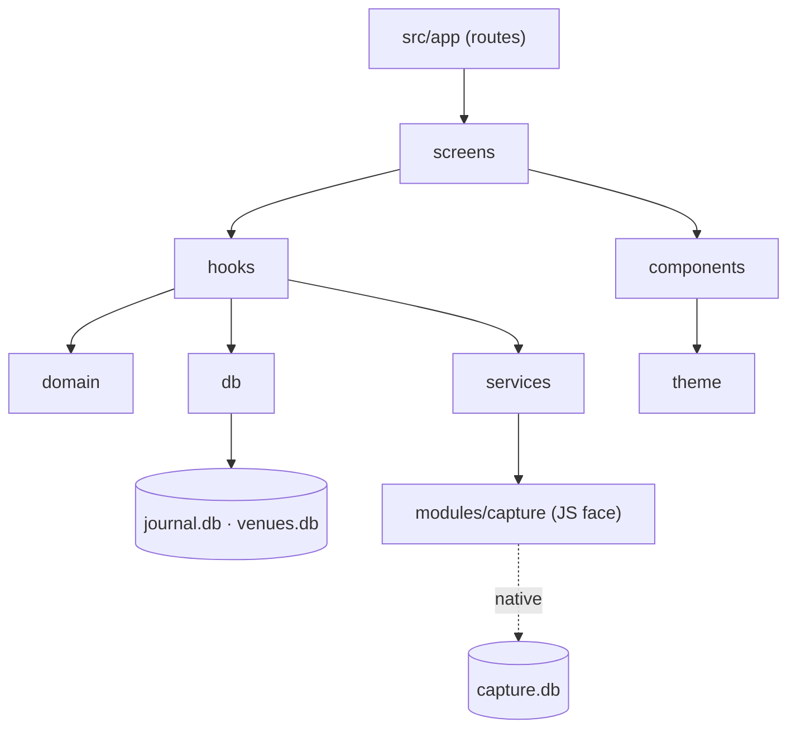
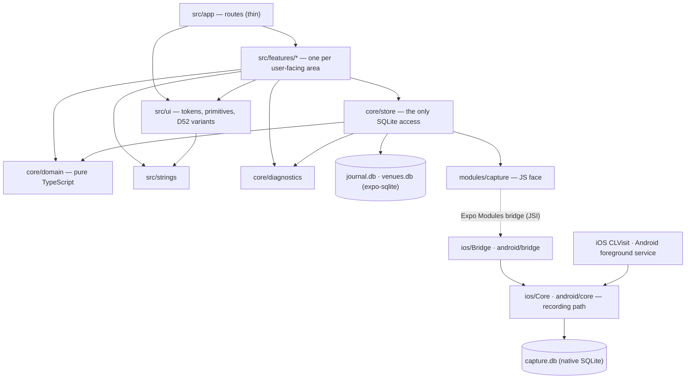
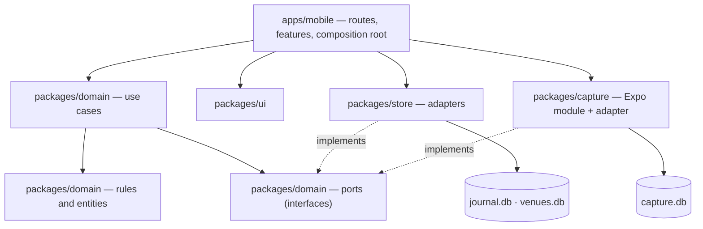

# Code architecture proposals — Haunts (SPK-20, D59)

**Seat:** CTO · **Date:** 2026-09-27 · **Ticket:** SPK-20 (FT-PLAN-6, M0) · **Decision it serves:** D59
**Status:** Proposal for the CEO's decision. **Not adopted.** No product code reaches `haunts` until the CEO decides (D59). D59 also requires review by a seat other than the CTO, and a CSO security review, before adoption (§9).
**Reads:** `decisions/2026-09-16-haunt-gate.md` (D1, D22, D23, D27–D59); `products/haunt/requirements.md` v1.3 (§2, §3, §4, §6, §7, §8.3, §9, §12, §14, §15, §16); `android-and-stack-note.md`; `design-feasibility-and-sizing.md` (§4, §10); `feasibility-note.md` (§3–§5); `haunts/CLAUDE.md` and `haunts/docs/conventions.md` (with the arrow-function rule on branch `refactor/SPK-15-arrow-functions-2`).
**Evidence tags** per `pipeline/evidence-standard.md`: [E] retrieved this session, link given (register at §11); [K] model knowledge, not verified; [I] inference; [J] judgment. Every vendor claim rests on the vendor's own page, so each is **single source** — the right source for how that vendor's product behaves.

---

## Page one — for the CEO

**What you are deciding.** How the Haunts code is organised: which folder a piece of code lives in, which parts are allowed to use which, and how a tool checks that automatically. Every option below runs the same app on the same stack (Expo, React Native, TypeScript, SQLite, native Swift and Kotlin for capture). They differ in **how the code is sorted and how strictly the sorting is enforced.**

**The three options, side by side.**

| | **A. Sorted by kind** | **B. Sorted by feature, on a small shared core** *(recommended)* | **C. Strict layers in separate packages** |
|---|---|---|---|
| **In one line** | Folders by what code *is*: `components/`, `screens/`, `hooks/`, `db/`. What Expo's own template and Ignite do. | One folder per part of the app you can see (`confirm/`, `timeline/`, `venue/`, `settings/`…), all resting on one shared **core** that holds the journal's rules and its database code. | "Clean architecture": the rules, the database, and the app are separate packages, joined through interfaces. |
| **To find the venue page's code** | Look in four folders. | Look in `features/venue/`. | Look in three packages. |
| **What stops a mess** | A few lint rules. Features can reach into each other freely. | Lint rules checked on every commit: features can't reach into each other; the rules can't touch the screen or the database; only one folder may touch the database. | Package walls: code can't import what its package doesn't declare. |
| **Set-up effort** [J] | 14–24 h | 20–34 h | 45–80 h |
| **Ongoing friction** [J] | Low at first, rises as the app grows past ~30 screens | Low throughout | ~10–15% more files and wiring per feature |
| **Running cost** | £0 | £0 | £0 |
| **Main risk** | The venue, sessions and confirm code tangles, because nothing keeps it apart | A "core" that quietly grows into a junk drawer, so it has a written rule of what may enter it | Ceremony a one-person product doesn't need; slower for every agent and every change |

**My recommendation: B.** It is the shape the current well-known starters converge on (Obytes; "bulletproof" React) [E, §2], it keeps each thing you'd point at on the screen in one place, and it puts the parts that must never go wrong — sessions, venue identity, the store — in one small tested core that has no screen code in it at all. It is enforced by a single tool (ESLint) that arrives with Expo anyway, and it costs nothing to run. It fits the estimate's existing set-up and data-layer rows rather than adding to them [I, §3.2 of the stack note].

**What I am deliberately *not* doing** (full list at §7): no state-management library, no ORM, no server-data library, no dependency-injection framework, no monorepo, no translation library yet, no network code at all in the app. Each is a thing the popular starters include and Haunts doesn't need, because Haunts has no server.

**Two findings you should know about, because they are the honest bad news.**

1. **The "one database file shared by Swift, Kotlin and JavaScript" plan has a corruption hazard.** Expo's SQLite ships its own copy of SQLite; the Swift and Kotlin capture code would use the phone's copy. SQLite's own documentation says two copies in one app opening the same file can corrupt it [E, §5]. **My proposed fix, in every option:** two files, each with one owner — the capture code owns a small capture file, the app owns the journal file, and they talk through a typed interface. It is simpler as well as safer, but it changes the wording of DATA-1 and DATA-2, so it goes to the PM/BA as a scope-change row, not decided here (§5).
2. **Android backs up app data to Google Drive by default, and iPhones include app files in iCloud device backups by default** [E, §6.13]. Nothing in the requirements yet says what Haunts does about that, and DATA-6 says nothing leaves the device until the user chooses. **That is a user-data policy question, so it is yours** (Constitution 5.4), after the CSO and CGO have looked. The architecture puts the answer in one place so either answer is a one-line change.

**The decisions, one at a time.**

1. **Now: choose A, B or C.** (Recommended: B.)
2. After review: the PM/BA takes the two-file store (finding 1) as a §24 row; you see it only if a seat disagrees.
3. Later, after CSO and CGO notes: finding 2, OS-level backups.

---

## 1. The frame every option shares — what the requirements and decisions already fix

None of this is up for choice in the options; it is what the options must fit. D59 names it: *"CAP-1 (no JavaScript in the capture path), the zero-network and PRIV-8 enforcement, SESS-1 (derived sessions), the venue schema rules (VEN-7 … VEN-12), the theme register (D52), Native Tabs (D53), TypeScript only with arrow functions (D41), and the traceability conventions (D37)."*

| Fixed by | What it forces on the code |
|---|---|
| **CAP-1** (BLOCKING): *"The Swift and Kotlin modules receive the platform event, read entitlement, and write to SQLite directly. JavaScript reads later."*; CAP-1(b): *"the capture module's dependency graph contains no bridge call"* | Capture is native code with **its own entry points that run without React Native** (iOS AppDelegate subscriber, Android lifecycle listener and foreground service). Its recording code must be separable from its bridge code, so (b) can be a mechanical check (§6.4). |
| **SESS-1, SESS-2, SESS-9** | Sessions are a **pure function** of (visits, overrides, entitlement intervals, gaps). Overrides are rows anchored to visits. Any cache is disposable. This wants a domain layer with no database and no React in it, so the function can be tested alone (SESS-1(a), the cache-deletion test). |
| **VEN-7 … VEN-12** | Venue identity lives in **Candour-owned rows**; the shipped index is read-only input; VEN-8's rule is **a trigger in the schema**, *"not in application code"*. Schema is SQL, versioned, and itself under test. |
| **VPAGE-4** (BLOCKING): *"no entitlement read is reachable from any journal query"*, checked in CI on every build | Entitlement code and journal-query code must live in places a static check can tell apart. |
| **DATA-1 … DATA-5** | One serialiser for export, import and restore; a published, versioned schema; *"a named migration owner, WAL and one-writer discipline"*. |
| **DATA-13** (BLOCKING): *"The diagnostics buffer is a separate logging channel the journal layer is architecturally unable to write into"* | The logger's API must make journal content unwritable by construction (§6.10). |
| **PRIV-8** (BLOCKING): *"CI fails the build if the dependency tree contains a known analytics package or any outbound HTTP call site outside the backup module"* | One named network boundary, checked in CI (§6.8). |
| **CAP-8(c), DFLT-1(a), THEME-6(a), CONF-4(b), CONF-11(b), VEN-6(a), VEN-23(b), MEM-1(a), PLAT-6(c)** | A family of **"enumerate it in CI" criteria**: every notification construction site, every setting (the register), the theme list as a build-time constant, list lengths and radii as named constants, the nine-cell query as a named function, one string table searchable for banned words, no product name rendered from an identifier. The architecture must give each of these **one home**, or the check has nothing to point at. |
| **THEME-1, D52** | Components read tokens and **never branch on a theme name**; theme-specific components are a short, listed register (the CTO's standard at `design-feasibility-and-sizing.md` §4.1, which this adopts unchanged). |
| **D53–D55** | One `NativeTabs` navigator, hidden in Retro, with Retro's own bar component (`design-feasibility-and-sizing.md` §10.6). |
| **D41, D37, D39** | TypeScript only; **arrow functions preferred**, with the `this` / `arguments` / generator exceptions (`conventions.md`, TypeScript style — enforcement is MAINT-4, #308); commits keyed to tickets; merge commits. A route file therefore reads `const VenueRoute = () => …; export default VenueRoute;`, never `export default function`. |
| **D33, D34** | Every requirement ticket carries a **files** and **file ownership** section, TBD until this architecture exists. **The chosen option must make "which files does CAP-4 touch?" answerable in one line.** That is a quiet but real test of each option (§3–§4). |
| **PLAT-1** | Expo prebuild / CNG, development builds, local Expo modules. Stated by the CTO at `android-and-stack-note.md` §2.7 and adopted. |

---

## 2. What current practice says — surveyed, not copied

I read the sources' own pages this session. What each says, and what Haunts takes from it.

| Source | What it says [E] | What Haunts takes |
|---|---|---|
| **Expo Router** (core concepts) | *"In Expo Router, the src/app directory is exclusively for defining your app's routes. Other parts of your app, like components, hooks, utilities, and so on, should be placed in other directories"*; rule 6: *"Non-navigation components live outside the src/app directory."* | **Routes are thin.** `src/app/` holds route files only; they import a screen and render it. Every option does this. |
| **Expo Router** (src directory) | *"Move your app directory to src/app"*; config files *"should remain in the root directory"*; custom roots are *"highly discouraged"*; SDK 55+ templates already use `src/app`. | App code under `src/`, config at the repo root, **no custom router root.** |
| **Obytes starter** | `features/` hold *"feature-oriented modules"* with screens, components, api and stores; `app/` is *"app routes and layouts (Expo Router)"* serving as **thin re-export layers**; `components/ui/` is the design system; `lib/` is *"core infrastructure"*. | The closest published shape to Option B. |
| **Bulletproof React** | *"organize most of the code within the features folder"*; *"It might not be a good idea to import across the features. Instead, compose different features at the application level"*; code flows *"shared -> features -> app"*, enforced by ESLint `import/no-restricted-paths` zones. | The **no-cross-feature-imports** rule and the **enforcement mechanism** for Option B. It is a web (React) reference, so its folders are adapted, not copied. |
| **Ignite** (Infinite Red) | *"battle-tested React Native project boilerplate"*, *"Developed and maintained consistently since 2016"*; folders `components`, `screens`, `services`, `theme`, `navigators`, `i18n`, `utils`, `context`; MMKV persistence; apisauce for REST. | The by-kind layout of Option A. Its REST client and key-value persistence don't apply: Haunts has no server, and SQLite is already the store. |
| **Feature-Sliced Design** | Seven layers (app, processes [deprecated], pages, widgets, features, entities, shared); *"modules on one layer can only know about and import from modules from the layers strictly below"*; *"slices cannot use other slices on the same layer"*. | **Surveyed and not adopted.** The layer rule is sound and Option B uses its essence (one direction, no sideways imports); seven layers is more vocabulary than a one-developer app with ~25 screens needs [J]. |
| **Expo local-first guide** | Local-first means *"the availability of another computer should never prevent you from working"*; lists Expo SQLite as the persistence layer and sync libraries (Legend-State, TinyBase, Yjs, …); says tools are *"in their early stages"*. | Haunts is **local-only**, which is simpler than local-first: nothing syncs, so no sync library, CRDT or conflict resolution applies. SQLite is the single source of truth. |
| **TanStack Query** | Makes *"fetching, caching, synchronizing and updating server state … a breeze"*; server state *"Is persisted remotely in a location you may not control or own"*. | **Does not apply.** Haunts has no server state. |
| **Expo Modules API** | Write *"Swift and Kotlin"*; *"similar performance characteristics to React Native's Turbo Modules API. Both APIs leverage … JSI"*; *"Use Turbo Modules if you need C++ integration"*; all Expo modules *"support the New Architecture"*. | **Expo Modules API** for capture (§6.4). |
| **React Native, Turbo Native Modules** | A typed spec, Codegen configuration, Objective-C++ on iOS and a Kotlin module plus package registration on Android. | The heavier route, rejected for Haunts (§6.4). |
| **SQLite, "How to corrupt"** §2.3 | *"if multiple copies of SQLite are linked into the same application … A close() operation on one connection might unknowingly clear the locks on a different database connection, leading to database corruption."* | The finding at §5. |
| **Expo SQLite** | Migrations by `PRAGMA user_version` in an `onInit` / `migrateDbIfNeeded` pattern; WAL recommended; `addDatabaseChangeListener`; FTS5 on by default; Drizzle mentioned as an integration. | Plain SQL migrations with Expo's own pattern (§6.1). |
| **Drizzle ORM** (Expo guide) | Migrations generated by `drizzle-kit`, bundled into the JS bundle through a Babel inline-import plugin, run by a `useMigrations` hook; the guide installs `drizzle-orm@rc`. npm: `latest` is **0.45.3**; the 1.0 line is at `rc` (**1.0.0-rc.4**). | **Not adopted** (§6.1): its migrations run in JavaScript, which is the one side CAP-1 says may not be running, and it is mid-way through a major version. |
| **Maestro**, **Detox**, **EAS Workflows** | Maestro: *"Maestro tests the final bundled binary"*, *"zero instrumentation"*, `testID` recommended; EAS runs Maestro flows as YAML in `.maestro/`. Detox: *"gray box"* testing with *"access to the internals of the app"*. | **Maestro** for end-to-end (§6.9). |
| **Expo unit testing** | `jest-expo` *"mocks the native part of the Expo SDK"*; React Native Testing Library for components. | Jest for domain and components (§6.9). |
| **ESLint** / **eslint-plugin-import** / **dependency-cruiser** | `no-restricted-globals` with `checkGlobalObject` also catches `globalThis.fetch`; `import/no-restricted-paths` forbids imports between zones; dependency-cruiser *"Validate and visualise dependencies. With your rules."* (MIT). | ESLint for B's boundaries; dependency-cruiser for C (§6.7). |

---

## 3. Three names used in every option

To keep the options comparable, all three use the same three SQLite files, for the reason at §5:

- **`capture.db`** — owned by the native capture module (Swift and Kotlin). Holds capture candidates, capture gaps, entitlement intervals and the few capture settings the native side must read without JavaScript (CONF-16's "do not ask me"). Small, and rarely changes shape.
- **`journal.db`** — owned by the JavaScript app. Holds everything the user has written or confirmed: visits, venues (Candour-owned rows), ratings, notes, merges, overrides, photo references, settings. This is what DATA-1 means by *the* store.
- **`venues.db`** — the shipped venue index (VEN-1, VEN-4). Read-only, opened by the JavaScript app only.

The **capture module's JavaScript face** (`modules/capture/index.ts`) is the only way JavaScript sees `capture.db`: typed functions such as `listCandidates()`, `listGaps(range)`, `entitlementIntervals()`, `markAdopted(id)`, `discard(id)`, `recordEntitlement(interval)`, and one change event. **That interface is the Swift–Kotlin–TypeScript contract DATA-2 asks for**, and it is far smaller than a whole shared schema.

---

## 4. The options

### 4.A Option A — sorted by kind

**The idea.** Folders say what code *is*. This is the shape of Ignite (`components`, `screens`, `services`, `theme`, `navigators`, `utils` [E]) and of Expo's guidance that non-route code goes in *"src/components, src/hooks, and src/constants"* [E].

```
haunts/
├── app.config.ts · package.json · tsconfig.json · eslint.config.js · metro.config.js · eas.json
├── modules/capture/            native capture (the same in every option: §6.4)
├── plugins/                    config plugins
├── src/
│   ├── app/                    routes only
│   ├── screens/                QueueScreen, TimelineScreen, VenueScreen, ComposeScreen, SettingsScreen, …
│   ├── components/             ConfirmRow, CandidatePicker, VisitRow, GapRow, Stars, RetroTabBar, Ticker, …
│   ├── hooks/                  useQueue, useTimeline, useVenuePage, useTheme, …
│   ├── domain/                 sessions, venue-ranking, aggregates, headline-templates, settings-register
│   ├── db/                     migrations/, repositories, archive/ (export · import · restore)
│   ├── services/               capture (wraps modules/capture), diagnostics, entitlement
│   ├── theme/                  tokens, warm, mono, retro, ThemeProvider
│   └── strings/                en.ts
├── .maestro/
└── tools/
```



**What is enforced, and how.** ESLint only: `domain/` imports nothing from React, React Native, Expo, `db/` or `services/`; only `db/` imports `expo-sqlite`; only `services/capture.ts` imports the capture module; no network globals anywhere (§6.8); no theme-name literals outside `theme/`; the native capture-isolation check (§6.4). **Not enforced: anything between screens, components and hooks.** Any hook may call any repository; any component may import any other.

**Worked example — "confirm a visit".** Capture is identical to §4.B steps 1–2. Then: `src/app/(tabs)/index.tsx` renders `screens/QueueScreen.tsx` → `hooks/useQueue.ts` calls `services/capture.ts` and `db/visits.ts`, then `domain/sessions.ts` to group → `components/ConfirmRow.tsx` and `components/CandidatePicker.tsx` render it, with `hooks/useCandidates.ts` calling `db/venue-index.ts` and `domain/venue-ranking.ts` → on confirm, `hooks/useConfirm.ts` calls `db/visits.ts` `confirmVisit()` and `services/capture.ts` `markAdopted()` → the venue page is `screens/VenueScreen.tsx` + `hooks/useVenuePage.ts` + `domain/aggregates.ts` + `components/VisitRow.tsx`. **One user journey, files in six folders.**

**Pros.** The most familiar shape; every React Native developer and every agent has seen it. Fewest rules. Fastest to start.
**Cons.** The confirm flow, the venue page and the session UI share hooks and components with nothing saying which belongs to which — and they are the places the requirements most need kept straight (CONF-13 and SESS-3 are *"the same data structure viewed twice"*, `requirements.md` §6). A ticket's files section (D33) becomes a list across five folders. `components/` becomes the largest folder and the hardest to navigate [J — the common failure of this shape, stated as judgment]. Cutting a feature at the §20.2 cut line means hunting for its files.
**Cost** [J]: 14–24 h set-up (routes, folders, ESLint zones for `domain` and `db`, test harness). £0 running. Friction rises with size; Haunts has roughly 25 screens and 197 requirement IDs, which is past the size where this shape starts to hurt [J].

### 4.B Option B — sorted by feature, on a small shared core *(recommended)*

**The idea.** One folder per thing the user can point at. Everything that must be right everywhere — the journal's rules and its storage — lives in one small shared **core** with no screens in it. Routes are thin. Features never import each other; they meet in routes. This is the Obytes shape with the bulletproof rule [E].

```
haunts/
├── app.config.ts · package.json · tsconfig.json · eslint.config.js · metro.config.js · eas.json
├── modules/
│   └── capture/                     local Expo module — CAP-1…10, gaps, entitlement intervals
│       ├── expo-module.config.json
│       ├── index.ts                 the typed JS face: reads, commands, one change event. Nothing else.
│       ├── schema/                  capture.db migrations, 0001_init.sql … (native-owned; §6.1)
│       ├── ios/Core/                recording path: CLVisit → capture.db. No ExpoModulesCore, no React.
│       ├── ios/Bridge/              CaptureModule.swift (the Expo module) + AppDelegate subscriber
│       ├── android/…/core/          foreground service, activity recognition, clustering → capture.db
│       └── android/…/bridge/        CaptureModule.kt + lifecycle listener
├── plugins/                         config plugins: FGS manifest, alternate icons, backup rules (§6.13)
├── src/
│   ├── app/                         Expo Router routes ONLY. Each file renders one screen from features/.
│   │   ├── _layout.tsx              providers, root ErrorBoundary
│   │   ├── (tabs)/_layout.tsx       the one NativeTabs navigator (hidden in Retro) + RetroTabBar
│   │   ├── (tabs)/index.tsx         home: headlines + queue
│   │   ├── (tabs)/timeline.tsx · (tabs)/places.tsx · (tabs)/settings/…
│   │   └── venue/[venueId].tsx · visit/[visitId].tsx · compose.tsx · …
│   ├── features/                    one folder per thing a user can point at
│   │   ├── confirm/                 queue, confirm row, candidate picker, bulk actions     CONF, SESS-3
│   │   ├── timeline/                timeline, gap rows, split / merge / undo               CAP-4, SESS-4/5/8
│   │   ├── venue/                   venue page, merge, rename, duplicate hint              VPAGE, VEN-14…16, VEN-21
│   │   ├── compose/                 manual entry                                           ENT-4
│   │   ├── headlines/               home headlines                                         HEAD
│   │   ├── look/                    heatmap, ranked list, recap, self-portrait             LOOK
│   │   ├── my-data/                 export, import, backup                                 DATA, PHOTO-3/6
│   │   ├── plans/                   trial status, purchase, restore, cancel link           ENT, PRICE
│   │   ├── onboarding/                                                                     ONB
│   │   └── settings/                appearance, privacy screen, licences, report a problem THEME, PRIV, LIC
│   ├── core/                        the journal itself. No screens. Entry rule in core/README.md.
│   │   ├── domain/                  pure TypeScript: sessions, venue-ranking, aggregates, headline
│   │   │                            templates, settings register, time. No React, no Expo, no SQLite.
│   │   ├── store/                   the only code that touches SQLite or the capture module
│   │   │   ├── migrations/          journal.db: 0001_init.sql … (VEN-8's trigger lives here)
│   │   │   ├── db.ts · migrate.ts   open + migrate journal.db; open venues.db read-only
│   │   │   ├── visits.ts · venues.ts · overrides.ts · photos.ts · settings.ts    journal repositories
│   │   │   ├── venue-index.ts       nine-cell query (VEN-23), prefix search (CONF-5)
│   │   │   ├── capture.ts · entitlement.ts   wrappers over modules/capture
│   │   │   ├── live.ts              useLive(): re-run a read when its tables change
│   │   │   └── archive/             one serialiser: export · import · restore (DATA-3, DATA-5)
│   │   └── diagnostics/             typed event log; no free-text parameter (DATA-13)
│   ├── ui/                          the design system
│   │   ├── theme/                   tokens.ts · warm.ts · mono.ts · retro.ts · ThemeProvider
│   │   ├── primitives/              Text, Button, Row, Card, Stars, Sheet, …
│   │   └── variants/                the D52 register: RetroTabBar, headline renderers — each listed
│   │                                with its reason in variants/README.md
│   └── strings/                     en.ts — the one string table
├── .maestro/                        end-to-end flows, named by limb
└── tools/                           repository tooling (SPK-15), with its own tsconfig
```

**Inside a feature**, only the files it needs (bulletproof: *"You don't need all of these folders for every feature. Only include the ones that are necessary."* [E]):

```
features/venue/
├── venue-screen.tsx          the screen (an arrow-function component)
├── use-venue-page.ts         the feature's hook: calls core/store and core/domain
├── components/               merge-sheet.tsx, rename-field.tsx, duplicate-hint.tsx
└── __tests__/                VPAGE-3(a) venue page complete.test.tsx, …
```


*Arrows mean "may import". Anything not drawn is forbidden. `ncore`, `capdb` and the OS event run without JavaScript (CAP-1).*

**What is enforced, and how** (in `eslint.config.js`, run by pre-commit and CI; details at §6.7):

| Rule | Mechanism |
|---|---|
| Routes import only feature screens, `ui` and Expo Router | `import/no-restricted-paths` zone |
| A feature never imports another feature | `import/no-restricted-paths`, one zone per feature — the bulletproof pattern [E] |
| `core/domain` imports nothing outside itself: no `react`, `react-native`, `expo*`, `core/store` | `no-restricted-imports` patterns plus a zone |
| Only `core/store` imports `expo-sqlite` or `modules/capture` | `no-restricted-imports` everywhere else |
| Journal repositories and `archive/` never import `entitlement.ts` (VPAGE-4) | a zone, plus VPAGE-4's own CI test |
| `core` never imports `features`, `app` or `ui` | a zone |
| No network: `fetch`, `XMLHttpRequest`, `WebSocket`, `EventSource` banned everywhere, including through `globalThis` | `no-restricted-globals` with `checkGlobalObject: true` [E]; §6.8 |
| No theme-name literal outside `ui/theme` | `no-restricted-syntax` on string literals (`design-feasibility-and-sizing.md` §4.1 item 3) |
| No user-facing text literal in JSX outside `strings/` | a JSX-literal lint rule [K — which rule is chosen at MAINT-4] |
| Native recording path imports no bridge (CAP-1(b)) | `tools/check-capture-isolation.ts`: fails if any file under `ios/Core/` imports `ExpoModulesCore` or `React`, or any file under `android/…/core/` imports `expo.modules` or `com.facebook.react` |

**The core entry rule**, written into `core/README.md`, because a shared core is where a junk drawer grows. Code enters `core/` only if **(a)** two or more features need it, **(b)** a requirement names it as a testable unit (SESS-1, VEN-23(b), CONF-8(b), CONF-11(b), VPAGE-3), or **(c)** it touches SQLite or the capture module. Presentational components shared by two features go to `ui/`, never to `core/`. Everything else stays in its feature. The CTO applies the rule in review.

**Worked example — "confirm a visit": capture → queue → confirm → venue page.**

1. **Capture, iOS, app not running.** iOS relaunches the app in the background to deliver a `CLVisit` (`android-and-stack-note.md` §2.2, citing Apple via the feasibility note). `ios/Bridge/CaptureAppDelegateSubscriber.swift` — an `ExpoAppDelegateSubscriber`, which can handle `application(_:didFinishLaunchingWithOptions:)` [E] — starts `ios/Core/VisitRecorder.swift` and nothing else. `VisitRecorder` asks `ios/Core/EntitlementCheck.swift` whether capture was entitled at the visit's arrival, by reading `entitlement_interval` in `capture.db`, then writes one `candidate` row, with `departure = NULL` where iOS gave none (CAP-2(b)). **No React Native, no Hermes, no bridge.** CAP-1(a)'s instrumented test is written against exactly this path, and must be re-run on SDK 58's scene-based life cycle (`design-feasibility-and-sizing.md` §10.7).
2. **Capture, Android.** `android/…/core/CaptureService.kt` is the location foreground service (CAP-3), started at boot by a receiver and at app start by an `ApplicationLifecycleListener` [E]; `StayClusterer.kt` turns batched fixes into a stay and writes the same `candidate` row to `capture.db`. `GapRecorder` writes gaps the same way on both platforms (CAP-4).
3. **The queue.** The user opens Haunts. `src/app/(tabs)/index.tsx` is a few lines: it renders `features/confirm/queue-screen.tsx`. The hook `features/confirm/use-queue.ts` calls `core/store/capture.ts` → `listCandidates()` and `listGaps()` (the capture module's JS face), `core/store/overrides.ts` for the user's split and merge constraints, and `core/domain/sessions.ts` → `deriveSessions(visits, candidates, overrides, intervals, gaps)` to get one row per night (SESS-3). `core/store/live.ts` re-runs the read when the capture module fires its change event or `journal.db` changes.
4. **The candidate picker.** `features/confirm/components/candidate-picker.tsx` calls `core/store/venue-index.ts` → `nearby(lat, lon, radius)`, the named nine-cell union (VEN-23(b)), and `searchPrefix(text)` (CONF-5, FTS5); then `core/domain/venue-ranking.ts` → `rank(rows, priorConfirmations, query)`, where the sticky prior (CONF-11, with `STICKY_RADIUS_M = 150` a named constant) and the generic-token suppression (CONF-8(b), a named function) live. Nothing is pre-selected (CONF-3): the picker's selection starts as `null`, and no code path sets it except a tap.
5. **Confirm.** `use-queue.ts` calls `core/store/visits.ts` → `confirmVisit({ candidateId, venue, rating, note })`: **one transaction in `journal.db`** that copies the venue row on first reference and sets `first_referenced_at` (VEN-7), inserts the visit with a unique `source_candidate_id`, and writes the rating and note. It then calls `markAdopted(candidateId)` on the capture module. Two files means no transaction spans both, so the step is **idempotent**: at every app start, `core/store/capture.ts` marks adopted any candidate whose id already appears as a `source_candidate_id`. A crash between the two writes costs one reconcile, never a duplicate or a lost visit [I].
6. **The venue page.** Tapping the venue navigates to `/venue/[venueId]`. `src/app/venue/[venueId].tsx` renders `features/venue/venue-screen.tsx`; `use-venue-page.ts` calls `core/store/venues.ts` → `getVenue(id)`, which reads **only** the Candour-owned row and never `venues.db` (so VEN-7's delete-the-index test passes by construction), and `core/store/visits.ts` → `listForVenue(id)`; then `core/domain/aggregates.ts` → `venueSummary(visits)` gives the true mean and the count together (VPAGE-6) over the complete set (VPAGE-3). It renders with `ui/primitives` in whichever theme is active; the screen never knows which.

**The files a ticket would list** (D33), e.g. CAP-4: `modules/capture/ios/Core/GapRecorder.swift`, `modules/capture/android/…/core/GapRecorder.kt`, `modules/capture/schema/*`, `core/store/capture.ts`, `core/domain/sessions.ts`, `features/timeline/components/gap-row.tsx`, `strings/en.ts`. Short, and predictable before anyone opens an editor.

**Pros.** A feature is one folder, so tickets, reviews, parallel waves (D34 file ownership) and cuts are local. The riskiest logic sits in one small core with no React and no SQLite, which Jest tests in milliseconds. It mirrors the requirements' own grouping (CONF, VPAGE, LOOK, HEAD…), so most requirement series map to one folder. Enforcement is one tool the project has anyway.
**Cons.** Two ideas to learn instead of one ("feature" and "core"). Some judgment at the edges: a component two features need must move to `ui/` and become purely presentational. The core can grow into a junk drawer unless its entry rule is held in review.
**Cost** [J]: **20–34 h set-up** — routes and folders (4–6), ESLint zones and the capture-isolation check (6–10), the Node SQLite test adapter (§6.9, 4–6), `core/README.md` and the first migrations (6–12). It sits inside the stack note's rows 1 and 7 (set-up, data layer) rather than adding to them [I]. £0 running; development dependencies only (§6.7), for the CSO to approve.

### 4.C Option C — strict layers in separate packages

**The idea.** "Clean architecture" or ports-and-adapters, made physical. The journal's rules are a package with no dependencies; storage is a package that implements interfaces ("ports") the rules declare; the app wires them together in one composition root; use cases are explicit functions. Packages are npm workspaces, so a package cannot import what its `package.json` does not declare. Expo supports this: *"Expo configures Metro automatically for monorepos"* since SDK 52, with npm workspaces among those supported, and warns that monorepos *"increase complexity"* [E, Expo monorepo guide].

```
haunts/
├── package.json                     workspaces: ["apps/*", "packages/*"]; tooling devDependencies stay here
├── tools/ · .maestro/
├── apps/
│   └── mobile/                      the Expo app
│       ├── app.config.ts · package.json · tsconfig.json · metro.config.js · eas.json
│       ├── plugins/
│       └── src/
│           ├── app/                 routes only
│           ├── features/            screens and their components, as in B
│           └── composition.ts       builds every use case with its adapters: the only wiring point
├── packages/
│   ├── domain/                      package.json with ZERO dependencies
│   │   └── src/ entities/ · ports/ (VisitRepository, CaptureSource, VenueIndex, Clock) · rules/ (sessions,
│   │                               ranking, aggregates) · use-cases/ (confirmVisit, splitNight, mergeVenues, …)
│   ├── store/                       adapters: expo-sqlite implementations of the ports; migrations; archive
│   ├── capture/                     the local Expo module (Swift + Kotlin) and its CaptureSource adapter
│   └── ui/                          design system, themes, D52 variants, strings
```



**What is enforced, and how.** The strongest of the three. Package manifests: `packages/domain` declares no dependencies, so importing React or `expo-sqlite` there fails to resolve; `store` cannot import `ui`; TypeScript project references make each package compile alone. **dependency-cruiser** (MIT [E]) checks what manifests cannot: no cycles, features never importing each other, adapters never imported by features directly (only through `composition.ts`). The same network and theme rules as B.

**Worked example — "confirm a visit".** Capture as B steps 1–2, inside `packages/capture`. The queue screen in `apps/mobile/src/features/confirm/` calls a use case received from context: `listQueue()` from `packages/domain/src/use-cases/list-queue.ts`, which asks the `CaptureSource` port for candidates and the `VisitRepository` port for overrides, then calls `rules/sessions.ts`. The composition root has handed it the `store` and `capture` adapters. Confirming calls the `confirmVisit` use case, which calls `VisitRepository.confirm()` — implemented in `packages/store/src/visit-repository.ts` as B's single transaction — then `CaptureSource.markAdopted()`. The venue page calls `getVenuePage(id)`, a use case over `VenueRepository` and `rules/aggregates.ts`. **Each step adds an interface, an implementation and a wiring line that B does not have.**

**Pros.** The boundaries are walls, not rules: they cannot be switched off by a lint comment. The domain package can be tested, and in principle reused, with no React Native anywhere. Swapping storage (another SQLite library, the §5 alternatives) touches one package.
**Cons.** Ceremony for a product with one developer, one data store and no server: every feature needs a port, an adapter, a use case and a wiring line [J]. Workspaces add Metro, autolinking and duplicate-dependency hazards Expo itself names [E]. `docs/conventions.md` §11 planned **one** `package.json`; this changes it. Agents and reviewers read three packages to follow one tap. The interfaces mostly have one implementation each, which is the classic sign an abstraction is not paying [J].
**Cost** [J]: **45–80 h set-up** (workspaces, per-package tsconfig and references, Metro and autolinking checks, dependency-cruiser rules, ports and composition root), then **~10–15% more files and wiring per feature** for the life of the product. £0 running. Adds roughly 1–2 weeks to the stack note's rows 1 and 7 [I].

### 4.D The three, compared on the questions D59 asks

| D59's words | A — by kind | B — feature + core | C — packages |
|---|---|---|---|
| **Intuitive** — can a newcomer guess where something is? | Yes for *kind* ("where are components?"); no for *feature* ("where is the venue page?") | Yes for both: the venue page is in `features/venue/`; the rules are in `core/` | After learning the vocabulary (port, adapter, use case, composition root) |
| **Clear** — one obvious place for each change? | Often two or three plausible places | One, with a written rule for the `core`/`ui` edge | One, but several files per change |
| **Simple** — fewest concepts that do the job? | Fewest concepts; weakest separation | Two concepts (feature, core); separation where the requirements need it | Most concepts |
| **Clear separation of concerns** | Only domain vs database | Features from each other; rules from screens and storage; storage in one folder; native recording from its bridge | All of B's, as physical walls |
| **Checked, not hoped for** | Partly (ESLint) | Yes (ESLint + one native check) | Yes (manifests + dependency-cruiser + ESLint) |
| **Set-up** [J] | 14–24 h | 20–34 h | 45–80 h |

---

## 5. The finding: two copies of SQLite in one app

**This applies to every option, and it changes a requirement's wording, so it is set out in full.**

**What the requirements say now.** DATA-1: *"One SQLite file, no opaque blobs."* DATA-2: *"The SQLite file is a written contract between four consumers — Swift, Kotlin, JavaScript and the store/billing layer — with a published schema spec, a named migration owner, WAL and one-writer discipline."* The CTO's own note proposed it: the Swift module *"writes it straight into SQLite in Swift"*, and *"the shared SQLite file is a contract between three implementations"* (`android-and-stack-note.md` §2.2).

**What I found this session.**

1. **Expo SQLite compiles its own copy of SQLite into the app, on both platforms.** Its README: *"To update bundled SQLite3 and SQLCipher source code under `vendor/`…"*, with a step to *"Replace sqlite3 symbols to prevent conflict with iOS system sqlite3"* [E, expo-sqlite README]. Its iOS podspec copies `vendor/sqlite3/sqlite3.c` into the pod; its Android `CMakeLists.txt` compiles `${SQLITE3_SRC_DIR}/sqlite3.c` into the `expo-sqlite` library [E, both files read at source on `main`].
2. **Native Swift and Kotlin code normally uses the platform's own SQLite** — `import SQLite3` or GRDB on iOS, `android.database.sqlite` on Android [K, high confidence]. So the plan as written puts **two copies of SQLite in one process, opening one file**: on iOS whenever the app is in the foreground while a visit arrives; on Android whenever the foreground service and the app share the default process [I].
3. **SQLite's own documentation says that corrupts databases.** §2.3 of *How To Corrupt An SQLite Database File*: *"if multiple copies of SQLite are linked into the same application … Database connections opened using one copy of the SQLite library will be unaware of database connections opened using the other copy … A close() operation on one connection might unknowingly clear the locks on a different database connection, leading to database corruption."* It adds that the SQLite developers know of *"at least one commercial product that was released with exactly this bug"* [E, sqlite.org].
4. **A second, independent problem with one shared file: migration order.** After an app update, iOS can relaunch the app for a visit **before JavaScript has ever run the new version** — that is CAP-1's whole point. If JavaScript owns the migrations (Expo's `onInit` pattern, or Drizzle's `useMigrations`, both of which run in JavaScript [E]), native code can meet a schema one version behind. If native code owns them, JavaScript and two native languages must agree on every migration of every table [I].

**The fix I propose: two files, one owner each** (§3). The native module owns `capture.db` with its own SQLite, and is the only code that opens it. JavaScript owns `journal.db` through Expo SQLite, and is the only code that opens it. JavaScript reads capture data only through the module's typed functions. **Each file is touched by exactly one copy of SQLite, so the corruption case cannot arise; each side migrates only its own file, so the ordering case cannot arise.** The venue index is a third file, read-only; if native code ever needs it (a future uncertain-match notification, CAP-9), SQLite's `immutable=1` open takes no locks at all [K — to verify before use].

**What it costs and what it buys** [J]:
- **Buys:** no corruption path by construction; the three-language contract shrinks from the whole schema to four small tables behind a typed interface; CAP-1(b) and VPAGE-4 become structural (the journal file holds no entitlement at all); the stack note's row 7 *"three-implementation SQLite contract"* largely disappears.
- **Costs:** a handful of bridge functions (≈ 1–2 days per platform); no single transaction across capture and journal, handled by the idempotent adopt step (§4.B step 5); export must read both files, which `archive/` does through the same interface.
- **Requirement wording:** DATA-1's *"One SQLite file"* becomes *"the journal is one SQLite file"* (the venue index is already a second file, so the literal wording was never quite true); DATA-2's contract becomes the capture module's interface plus `capture.db`'s schema. **That is a §24 scope-change row for the PM/BA**, not something this document decides. DATA-1's purpose — every user-authored field legible with the `sqlite3` tool — is untouched.

**Alternatives considered and rejected.**
- **Make native code use Expo SQLite's copy.** It is not a public interface: the iOS symbols are renamed and the Android copy sits behind Expo's JNI library [E, sources above]. Depending on another package's internals breaks at an SDK upgrade [J].
- **Route all JavaScript database access through our own native module**, so only the platform SQLite exists. Removes the hazard, but means writing a database bridge in two languages, and the Android framework SQLite's FTS5 support — which VEN-4 and CONF-5 need — is not something I could confirm [K, unverified]. More native code, the opposite of why React Native was chosen (`android-and-stack-note.md` §2.7).
- **Run Android capture in its own process** (`android:process`). SQLite's locking works across processes, so this fixes Android only; iOS has no equivalent [K].

**What would overturn this finding:** a documented, supported way for Swift and Kotlin code to open a database through Expo SQLite's own copy; or a measurement showing both copies share one lock table (they would have to be the same library). **Where I looked:** the expo-sqlite README, podspec and `CMakeLists.txt` on `main`; Expo's SQLite reference; sqlite.org's corruption page. **What I did not do:** reproduce corruption. It is intermittent by nature, which is why SQLite documents it rather than leaving it to be found.

---

## 6. Decisions that are the same in every option

The options differ in how code is sorted. These choices do not depend on that, and I recommend them whichever option is chosen. Paths are given in Option B's terms; §4.A and §4.C name their equivalents.

### 6.1 Data layer: plain SQL, repositories as functions, no ORM

- **Migrations are numbered plain `.sql` files**, one folder per database file: `core/store/migrations/` for `journal.db` (run by JavaScript), `modules/capture/schema/` for `capture.db` (run by Swift and Kotlin, each with a ~40-line migrator). Both use **`PRAGMA user_version`**, which is Expo's own documented pattern (*"Use `PRAGMA user_version` to track migration state"*, run from `SQLiteProvider`'s `onInit`) [E, Expo SQLite]. Each file has one migrator and one owner — DATA-2's *"named migration owner"*.
- **The schema is the contract, so it is SQL, not TypeScript.** VEN-8 requires its rule *"enforced in the schema, not in application code"* — a trigger, which lives naturally in a migration file. The published schema spec DATA-2(a) asks for is generated from the migrations by a small script, so the spec cannot drift from the database.
- **WAL** is set on both writable files at creation, as Expo recommends [E]. **One writer per table**, stated in the schema spec: capture tables written only by native code; journal tables written only by `core/store`. That is DATA-2's *"one-writer discipline"*, made checkable.
- **Repositories are plain exported arrow functions**, one module per aggregate (`visits.ts`, `venues.ts`, `overrides.ts`, `settings.ts` …), taking typed inputs and returning typed rows. No classes, no base repository, no query builder. Row types are hand-written next to the SQL, and **a schema test** (§6.9) fails if a table's columns and its row type disagree.
- **Store code talks to a four-method interface** — `run`, `all`, `get`, `transaction` — with two small adapters: Expo SQLite in the app, Node's built-in `node:sqlite` in tests (§6.9). This is the only "port" in the design, and it earns its place by letting every store test run against real SQLite in CI.
- **Why not Drizzle** (the popular choice [E, it is the ORM Expo's SQLite page names]): its Expo migrations are bundled into JavaScript and applied by a React hook [E], so they cannot serve the native side; its current Expo guide installs the **1.0 release candidate** while npm's `latest` is **0.45.3** [E, npm registry], so adopting it now means a major-version migration early in the build; and the SQL Haunts needs — triggers, FTS5, a nine-cell grid union — is written by hand in any ORM. **What would change this:** a stable Drizzle 1.0, and evidence that typed queries would have caught defects our schema test does not. It can be added later without moving a folder.

### 6.2 Derived sessions

`core/domain/sessions.ts` exports one pure function, `deriveSessions(visits, candidates, overrides, intervals, gaps, params)`, deterministic and total: every input produces sessions, low-confidence boundaries are **data** (`{ confident: false }`, SESS-5), and partiality is **data** (SESS-8), never an exception. Overrides are rows keyed by visit ids (SESS-2(c): *"no override is stored against a session identifier"*). **No session cache is built at first.** SESS-1 permits one but does not require it; I would add one only when a measurement on the slowest supported phone shows derivation is too slow for a year of use [J]. If it is built, it is a table in `journal.db` that `migrate.ts` drops on any change to `SESSION_ALGORITHM_VERSION` — which is exactly SESS-1(a)'s cache-deletion test.

### 6.3 State: SQLite is the state

- **Everything the user owns is in SQLite**, settings included. So theme, light-or-dark and headline appearance round-trip through export for free (THEME-5(b)), and DFLT-1's register is generated from one definitions file, `core/domain/settings.ts` (key, default, protective value, reason, source), which DFLT-1(a)'s CI check compares against the build.
- **Reads** are repository calls wrapped in one hook, `useLive(read, deps)` in `core/store/live.ts`, which re-runs when the relevant tables change (Expo SQLite's `addDatabaseChangeListener` for `journal.db` [E]; the capture module's change event for `capture.db`) and when the app returns to the foreground.
- **Ephemeral UI state** (what is typed in a search box, which sheet is open) is `useState` / `useReducer` in the screen. **Cross-screen state** is one React context per concern, and there are few: the active theme, and the open database handles.
- **No state library.** TanStack Query is for *"server state"* that *"Is persisted remotely"* [E]; Haunts has none. Redux, MobX and Zustand solve cross-screen client state at a scale this app does not have [J]. **What would change it:** a third or fourth cross-screen context, or a multi-screen flow whose draft state must survive navigation — then Zustand, small and MIT-licensed [K], for that flow only.

### 6.4 Native modules: Expo Modules API, with the recording path split from the bridge

- **Expo Modules API, local modules** (`npx create-expo-module@latest --local`, which generates `modules/<name>/` with `expo-module.config.json`, `index.ts`, `ios/`, `android/`, `src/` [E]). Expo's own comparison: *"similar performance characteristics to React Native's Turbo Modules API. Both APIs leverage … JSI"*, and *"Use Turbo Modules if you need C++ integration"* [E]. Haunts needs no C++. Turbo Modules would add Codegen specs and Objective-C++ on iOS [E] for no benefit. This confirms the stack note's choice (`android-and-stack-note.md` §2.2, §2.7).
- **The capture module is split in two on each platform:** `Core` (the recording path: OS event → entitlement check → `capture.db`; plain Swift or Kotlin, no Expo, no React) and `Bridge` (the Expo module class that exposes reads and commands to JavaScript, and the start-up hooks). **Core never imports Bridge.** `tools/check-capture-isolation.ts` fails CI if it does, which is CAP-1(b) made mechanical.
- **Native code runs without JavaScript through Expo's own hooks:** iOS `ExpoAppDelegateSubscriber`, declared under `apple.appDelegateSubscribers`, which handles `application(_:didFinishLaunchingWithOptions:)` [E]; Android `ApplicationLifecycleListener.onCreate`, found by autolinking [E]; plus the foreground service and a boot receiver declared by a config plugin.
- **Other native code, each small and each its own module or plugin:** the backup KDF (the CSO chooses it — `android-and-stack-note.md` §2.3), iOS file protection on the store files, MetricKit (`feasibility-note.md` §5 Layer 2), and alternate app icons through a config plugin (`design-feasibility-and-sizing.md` §2). Each gets its own ticket, and each keeps the same rule: nothing that runs without JavaScript imports anything that needs it.
- **Entitlement lives on the native side**, because CAP-1 and ENT-1 require capture to answer *"was capture entitled at 23:40 on 14 March?"* without JavaScript. Where purchases are made — a JavaScript billing library that calls `recordEntitlement()`, or StoreKit and Play Billing called natively — **is left to the entitlement spike**; it changes one module either way. **Flag:** a renewing subscriber who never opens the app may see capture stop at the old expiry unless the native side can refresh entitlement itself; this is ENT-2's "unknown" state and belongs to that spike, not to this document.

### 6.5 Theming: the standard already set, given a home

The CTO standard at `design-feasibility-and-sizing.md` §4.1 is adopted unchanged: one typed token schema, one object per theme (a missing token is a compile error); four values per colour (light, dark, and both higher-contrast), as `DynamicColorIOS` on iOS; components read tokens through one context and **never branch on a theme name** (lint-enforced); light or dark through `Appearance.setColorScheme`. **Its home:** `ui/theme/` (tokens and the three themes), `ui/primitives/` (components that only read tokens), and `ui/variants/` — **the D52 register**: every theme-specific component, each listed in `ui/variants/README.md` with its reason and the D-number that allowed it. The first two entries are the Retro tab bar (D54) and the three moving-headline renderers (D45, D49, `design-feasibility-and-sizing.md` §4.1 item 5). A new variant needs a README row, which is where the CTO confirms it is "a contained component" as D52 asks. THEME-2(a)'s contrast check runs over the token files in CI.

### 6.6 Navigation: Native Tabs, one navigator, thin routes

`src/app/(tabs)/_layout.tsx` holds the one `NativeTabs` navigator; in Retro it sets `hidden` and renders `ui/variants/retro-tab-bar.tsx`, which navigates through the router, so a theme change never remounts the navigator (`design-feasibility-and-sizing.md` §10.6). Routes stay thin: a route file imports one screen and renders it, and exports an `ErrorBoundary` where a tab needs its own (§6.10). **No deep links, universal links or URL schemes** are declared, because nothing outside the app needs to open a screen; a notification tap (CAP-8, CAP-9) opens the app, which is already the queue. **No custom router root** — Expo says it will *"not accept bug reports regarding projects with custom root directories"* [E].

### 6.7 Boundaries, checked by tools

- **ESLint** (flat config at the repo root) carries the boundary rules in §4.B's table, using ESLint's built-in `no-restricted-imports`, `no-restricted-globals` (with `checkGlobalObject: true` [E]) and `no-restricted-syntax`, and `import/no-restricted-paths` from eslint-plugin-import for zones [E]. It runs in the pre-commit hook on staged files and in CI on the whole tree. **The arrow-function rule** (D41 conventions) is already ticketed as MAINT-4 (#308); this adds boundary rules to the same configuration, so the two should land together.
- **Two small TypeScript checks** in `tools/`, for what ESLint cannot see: `check-capture-isolation.ts` (native imports, §6.4) and `check-network.ts` (native network APIs and the manifest, §6.8). Both follow D41: TypeScript, Node's type stripping, no dependencies.
- **Option C only:** dependency-cruiser (MIT [E]) for package-level rules and cycle detection.
- **New development dependencies** (ESLint, its Expo configuration, eslint-plugin-import or its maintained fork, jest-expo, React Native Testing Library) are named in the M1 scaffolding PR with licences, exact-pinned, and **approved by the CSO** (D40's rule). No new production dependency is introduced by the architecture itself.

### 6.8 The network boundary that makes PRIV-8 mechanically true

**The design goal is that Haunts contains no networking code at all**, rather than networking code confined to one module. That is achievable because every network path the product has is the operating system's, not the app's: the optional basemap download is an Apple-hosted asset pack or a Play asset pack (D22, D23); a cloud-only photo is fetched by the platform photo framework (PHOTO-11: *"The app itself opens no connection for this"*); crash reports are the platform's (PRIV-2); and backup, **on the CTO's standing recommendation that the user-saved encrypted file be the only backup at MVP** (`android-and-stack-note.md` §2.5; `requirements.md` §12.1), is a file the user saves through the system share sheet. Five layers, cheapest first:

1. **JavaScript:** `fetch`, `XMLHttpRequest`, `WebSocket` and `EventSource` banned by lint everywhere, including via `globalThis` [E]. **Remote image sources** (`{ uri: 'http…' }`) are banned by a `no-restricted-syntax` rule on string literals beginning `http`, with an allow-list for licence texts that merely *display* a URL.
2. **Native:** `tools/check-network.ts` fails CI if `modules/` or `plugins/` contain `URLSession`, `NSURLConnection`, `Network.framework`, `HttpURLConnection`, `OkHttp`, `java.net.Socket` or similar.
3. **Dependencies:** every production dependency is listed in `docs/dependencies.md` with its declared network behaviour, reviewed by the CSO; CI fails on a dependency not in the list, and on any from PRIV-8's *"known analytics package"* deny-list. **MapLibre** (D22) needs a line of its own: its style must reference only local sources, which a CI check asserts by scanning the shipped style for `http`.
4. **Android, the strongest form available: release builds declare no `INTERNET` permission.** A config plugin removes it from the release manifest, and a CI check reads the merged manifest. Without it the operating system itself refuses the app a socket [K, high confidence]. Whether any path Haunts needs — Play asset packs, Play Billing, photo fetch through the media provider — requires it in the app's own process is **unverified** [K]; it is a one-day spike item, and if it fails the other four layers stand.
5. **The ground truth, on device, each release:** DATA-6(a)'s and PHOTO-11(b)'s network capture across the core loop.

**If the CEO later chooses a cloud backup**, the one permitted place for app-owned networking is `features/my-data/backup/transport/`, allow-listed in layers 1 and 2, and Android's `INTERNET` permission returns. PRIV-8's *"outside the backup module"* is then literally true rather than vacuously true.

### 6.9 Testing, and how QA verifies by limb

| Layer | Tool | What it proves | Where it runs |
|---|---|---|---|
| **Domain** | Jest (plain TypeScript) | Sessions (SESS-1…8), ranking (CONF-8, CONF-11), aggregates (VPAGE-3, VPAGE-6), headline templates (HEAD, MEM-1(c)), the settings register | CI, every commit, seconds |
| **Store** | Jest + **`node:sqlite`** through the four-method adapter (§6.1) | Migrations, VEN-7…VEN-12 including the VEN-8 trigger, VEN-23's nine cells, DATA-4's diff test, DATA-3/5 round-trip, SESS-1(a) cache deletion, the schema test | CI, every commit. `node:sqlite` is **Release candidate** in Node 24 (*"v24.15.0 SQLite is now a release candidate"*) and needs no flag [E]; FTS5 prefix queries work in it (SQLite 3.51.3) [E, run locally] |
| **Components** | Jest + `jest-expo` + React Native Testing Library [E] | Accessibility labels (A11Y-6), no pre-selection (CONF-3), equal-weight bulk actions (CONF-13), identical accessibility tree across themes (THEME-1, the harness at `design-feasibility-and-sizing.md` §4.3) | CI, every commit |
| **Native** | XCTest (Swift), JUnit (Kotlin) [K] | Recorder, gap recorder, clustering, entitlement check, `capture.db` migrations | CI where a macOS runner is available; locally otherwise |
| **Instrumented** | Device or simulator | CAP-1(a) *Hermes never started*; CAP-2, CAP-3 reboot and kill; DATA-2(b)-equivalent concurrency (native write while JS reads) | Per release, and whenever capture changes |
| **End to end** | **Maestro**, flows in `.maestro/` [E] | The core loop, the confirm surface, export, lapse — the flows QA walks | Locally; EAS Workflows can run them [E], inside the free tier or as the contingency the stack note already names |
| **Static** | ESLint + `tools/check-*.ts` | Boundaries, CAP-1(b), CAP-8(c) notification sites, CONF-19(a) no contacts API, PRIV-8, MEM-1(a) string search, LIC-7(b) fonts, THEME-2(a) contrast, DFLT-1(a) register | CI, every commit |
| **Manual, on device** | QA's checklist | A11Y-10 in every theme, THEME-16 glass contrast, CAP-10 and VEN-24 field weeks | Per release |

- **Maestro over Detox:** Maestro *"tests the final bundled binary"* with *"zero instrumentation"* and prefers `testID` selectors [E]; Detox is *"gray box"* with *"access to the internals of the app"* [E] and needs native test wiring in the app [K]. For an app whose promise is about what the shipped binary does, testing the shipped binary is the better fit [J].
- **Why `node:sqlite` matters:** `jest-expo` *"mocks the native part of the Expo SDK"* [E], so without a real SQLite in tests, the triggers, FTS5 and the export diff — the BLOCKING data rules — could only be tested on a device. With it they run on every commit. **The residual risk:** Node's SQLite and Expo's bundled SQLite may be different versions; the instrumented tests run the same migrations on device, and both versions are recorded in the schema spec [I].
- **QA by limb.** Every test name starts with its limb (`CAP-4(a) …`), as `haunts/CLAUDE.md` already requires. A small `tools/limb-coverage.ts` lists every limb in `requirements.md` **at the ticket's stamped commit** and marks each as automated (the test that names it), manual (the checklist line that names it) or missing. QA verifies against the document at a recorded commit (D31(4)); the report tells QA where each limb's evidence is, and QA judges whether the evidence proves the limb.

### 6.10 Errors and logging, with no telemetry

- **Most of Haunts' "error states" are required honesty states, so they are data, not exceptions:** a capture gap (CAP-4), an unknown entitlement (ENT-2), an open-ended visit (CAP-2(b)), an unresolved photo (PHOTO-7), a low-confidence boundary (SESS-5). Domain functions return them as typed values, and screens render them as text in the accessibility tree (A11Y-8).
- **Genuine faults** (a failed migration, a full disk, a corrupt file) throw from `core/store`. Expo Router lets any route export an `ErrorBoundary` receiving `error` and `retry` [E]; the root layout has one, and each tab has its own, so one broken screen never takes down the app. The fallback is plain words, **Try again**, and **Report a problem** (DATA-13's bundle). No error screen ever shows journal content.
- **The diagnostics log is typed so journal content cannot enter it** (DATA-13): `core/diagnostics` exposes `log(event, fields)` where `event` is one of a fixed union of names and `fields` may only be numbers, booleans and enumerated codes — **there is no string parameter to put a venue name in**. Native code writes the same vocabulary to its own capped file. The DATA-13(a) CI test is the backstop. The log is a capped rolling file outside `journal.db`, so it is in neither export nor backup unless the user attaches it to a report.
- **No `console.*` in shipped code** (lint), and **no crash-reporting SDK** — crashes go to the platform, and source maps are archived per build (DATA-14).

### 6.11 i18n readiness: one string table, no library yet

All user-facing text lives in `src/strings/en.ts`, reached through a tiny `t(key, params)` function. **This is required anyway, not an i18n luxury:** MEM-1(a)'s build-wide string search, THEME-1's one string table and PLAT-6(c)'s *"no customer-facing string renders the product name from an identifier"* all need it. Dates and numbers go through `Intl` with the `en-GB` locale [K — Hermes `Intl` coverage to be confirmed at M1]. **Not done:** a translation library or `expo-localization`. Expo's guide lists i18n-js, react-i18next and Lingui [E]; any of them can replace `t()` later without moving a file, and Haunts' venue index and legal analysis are UK-only (`requirements.md` §16.1).

### 6.12 One home for each "enumerate it in CI" criterion

| Criterion | Its single home | Check |
|---|---|---|
| CAP-8(c) every notification construction site | `modules/capture` (native) — the only module permitted to build a notification | `tools/check-capture-isolation.ts` also greps `UNNotificationRequest` / `NotificationCompat` elsewhere |
| CONF-4(b), CONF-11(b), VEN-6(a) named constants | `core/domain/constants.ts`, mirrored in the schema spec | domain tests |
| CONF-19(a) no contacts API | nowhere — so any occurrence fails | `tools/check-network.ts` greps the contacts APIs too |
| DFLT-1(a) settings register | `core/domain/settings.ts` | a test compares it with the committed register |
| THEME-6(a) theme list is a build-time constant | `ui/theme/index.ts` | type + test |
| MEM-1(a), PLAT-6(c) string search | `src/strings/en.ts` + store metadata | `tools/check-strings.ts` |
| LIC-7(b) every bundled font on the licences screen | `assets/fonts/` + `features/settings/licences/fonts.ts` | a test maps one to the other |
| VPAGE-4 no entitlement read from journal queries | `core/store/entitlement.ts` is the only reader | lint zone + test |
| PRIV-8 | §6.8 | five layers |

### 6.13 Where the repository's pieces go, and one flag

- **The app lives at the repository root**, as `docs/conventions.md` §11 planned: one `package.json`, one lockfile. `tools/` keeps its own `tsconfig.json`; the root `tsconfig.json` becomes the app's; `npm run typecheck` runs both. Metro bundles only what the app imports, so `tools/` never enters the bundle [K, high confidence]. Path alias `@/` → `src/`.
- **The store files' location is set in one place per side** (`core/store/paths.ts`, and the native `CaptureStore`), because of the flag below.
- **Flag — OS-level backups (for the CSO and CGO, then the CEO).** *"Apps that target Android 6.0 (API level 23) or higher automatically participate in Auto Backup"*, and the default backup set includes *"Files in the directory returned by getDatabasePath(String)"* [E, Android Auto Backup]. On iOS, `Documents` and `Library/Application Support` are *"Included in iCloud and device backups"* by default, and a file can be excluded with `isExcludedFromBackup` [E, Apple]. So **by default Android would copy the journal to the user's Google Drive, unasked**, which DATA-6 (*"Nothing leaves the device until the user chooses it"*) does not contemplate; and an iPhone's own iCloud backup would include it, which is the user's phone backup rather than Haunts' — a distinction for the CGO. No requirement addresses either today (I searched `requirements.md`, the compliance note, the security baseline and the subscription note). **This is user-data policy, so the decision is the CEO's** (Constitution 5.4: *"anything affecting user data policy"*). DFLT-1's protective default would point to excluding both, at the cost that a lost phone loses the journal unless the user made a Haunts backup. The architecture makes either answer a one-line change.

---

## 7. What I am deliberately not doing

Each of these is common in React Native starters and is left out on purpose. Each could be added later without moving a folder.

| Not doing | Why not | What would change it |
|---|---|---|
| **A state-management library** (Redux, MobX-State-Tree, Zustand, Jotai) | SQLite is the state; the rest is screen-local (§6.3) | A third cross-screen context, or a multi-screen draft flow |
| **A server-state library** (TanStack Query, SWR) | Built for *"server state"* [E]; Haunts has no server | A server. Which would itself be a gate decision |
| **An ORM or query builder** (Drizzle, Prisma, Kysely) | Its migrations run in JavaScript, which CAP-1 cannot rely on; Drizzle is between major versions [E]; the hard SQL is hand-written anyway (§6.1) | Drizzle 1.0 stable, and a defect class our schema test misses |
| **A sync or local-first library** (Legend-State, TinyBase, RxDB, CRDTs) | Nothing syncs: Haunts is local-*only* (§2) | A sharing layer, which D5 sends through a full gate |
| **Any HTTP client or networking code** | Every network path is the OS's (§6.8) | A cloud backup chosen by the CEO — then one allow-listed folder |
| **Dependency injection** (containers, service locators) and **use-case classes** | One store, one set of adapters; plain function imports are enough (Option C is the version that has them) | A second storage implementation in production, not just in tests |
| **A monorepo or workspaces** | One app; Expo warns monorepos *"increase complexity"* [E] | A second app (a watch app, a web viewer) sharing code |
| **A translation library** | One language, UK-only product (§6.11) | A second language |
| **A generic UI kit** (NativeBase, Tamagui, Paper, React Native Elements) | Three bespoke themes on one token schema; a kit brings its own theming to fight [J] | None foreseen |
| **Feature-Sliced Design's seven layers** | Right idea, more vocabulary than ~25 screens need [J] | The app doubling in size |
| **A session cache** | SESS-1 permits, doesn't require; build it when measured (§6.2) | Derivation too slow on the slowest supported phone |
| **Code generators and boilerplate CLIs** (Ignite's generators) | One developer plus agents; templates in `docs/` do the same job [J] | — |
| **Deep links or URL schemes** | Nothing outside the app needs to open a screen (§6.6) | A feature that needs one |

---

## 8. Negative findings — what would overturn each, and where I looked

| Finding | What would overturn it | Where I looked |
|---|---|---|
| **One SQLite file shared by Expo SQLite and native code risks corruption** (§5) | A supported way for Swift and Kotlin to use Expo SQLite's own copy; or proof both use one library | expo-sqlite README, podspec, `CMakeLists.txt` on `main`; Expo SQLite reference; sqlite.org §2.3 |
| **Drizzle's migrations cannot serve the native side** | A Drizzle migrator that emits plain SQL a native migrator can run, documented for Expo | Drizzle's Expo guide; npm registry |
| **Turbo Modules add cost and no benefit here** | A capture requirement needing C++ or synchronous JSI calls Expo Modules cannot make | Expo Modules overview; React Native's Turbo Modules guide |
| **Detox is the weaker fit than Maestro** | Maestro unable to drive a flow QA must automate (permission dialogs, background relaunch) — a real possibility for the capture flows, which is why those are instrumented tests, not end-to-end | Maestro's React Native page; Detox's getting-started page; EAS Workflows' Maestro page |
| **No requirement yet covers OS-level backups** (§6.13) | A requirement or decision I missed | `requirements.md` (searched for Auto Backup, `allowBackup`, device backup, iCloud Backup), `compliance-note.md`, `repo-security-baseline.md`, `subscription-sizing-note.md`, the decision record |

---

## 9. Flags, a correction to my own earlier note, and who reviews this

**A correction to my own work, stated once.** The stack note (`android-and-stack-note.md` §2.2) specified one SQLite file written by Swift, Kotlin and JavaScript, and that became DATA-1 and DATA-2. **I did not check then whether Expo SQLite shares the platform's SQLite library. It does not** (§5). The two-file store corrects my design, not someone else's.

| To | Flag | Kind |
|---|---|---|
| **PM/BA** | A §24 row amending DATA-1 (*"the journal is one SQLite file"*) and DATA-2 (the contract is the capture module's interface plus `capture.db`'s schema), with §5 as the reason | Request |
| **CSO** | D59's security review of this document; approval of the new development dependencies (§6.7); the Android `INTERNET`-permission removal (§6.8 layer 4); the KDF (unchanged, still yours) | Review |
| **CSO, CGO → CEO** | OS-level backups (§6.13): whether the journal may enter Android Auto Backup and iOS device backups by default | User-data policy, Constitution 5.4 |
| **CGO** | Whether PRIV-1's sentence (*"Haunts sends your data nowhere else"*) stays true while Android Auto Backup is on by default | Flag |
| **CEO** (later, not now) | §12.1's backup shape: this architecture assumes the CTO's standing recommendation (user-saved encrypted file only). A cloud backup is a user-data-policy choice and yours | Decision, when backup is specified |
| **Entitlement spike** | Where purchases are made, and how the native side learns of a renewal without JavaScript (§6.4) | Scope for an existing open question (ENT-2) |
| **Engineer, M1** | Re-run CAP-1(a) on SDK 58's scene-based life cycle before capture work relies on it (`design-feasibility-and-sizing.md` §10.7) | Carried forward |
| **QA** | `tools/limb-coverage.ts` (§6.9) is a map to evidence, not a verdict; QA still judges each limb | For QA to accept or reshape |

**Review routing (D59).** D59 requires a seat other than the CTO to review this, and the CSO to review its security. I suggest the **Engineer** for the non-CTO review, because the question worth a second pass is buildability — will these rules and folders actually be pleasant to work in — rather than interpretation, which the evidence standard says a second agent pass does not make independent. The orchestrator decides.

**What happens after the CEO decides.** The chosen option's ADR is adopted (§10), the CTO fills the *files* and *file ownership* sections of M1's tickets (D33, D34), and the scaffolding PR builds the folders, the lint rules (with MAINT-4) and the two `tools/` checks, each seen to fail before it is trusted — the CSO's rule for the security baseline (D32), applied here too.

---

## 10. Draft ADR-0001 — ready to adopt if the CEO chooses Option B

*If the CEO chooses A or C, the CTO rewrites §Decision and §Consequences from §4.A or §4.C; §Context and the §6 decisions carry over unchanged.*

> # ADR-0001 — Code architecture: feature folders on a small shared core
>
> **Status:** Proposed — awaiting the CEO's decision under D59. · **Date:** 2026-09-27 · **Deciders:** CEO (decision), CTO (proposal) · **Reviews owed:** a seat other than the CTO; CSO (security) · **Ticket:** SPK-20 · **Supersedes:** none
>
> ## Context
> Haunts is an Expo / React Native app in TypeScript for iOS and Android, with native capture in Swift and Kotlin, no server and no network code. D59 asks for an architecture that is *"intuitive, clear and simple with clear separations of concerns"*, based on current practice. Requirements fix much of the shape: CAP-1 (no JavaScript in the recording path), SESS-1 (derived sessions), VEN-7…12 (Candour-owned venue rows, a schema trigger), VPAGE-4 (entitlement-blind journal queries), DATA-1…5 and DATA-13, PRIV-8, the theme register (D52) and Native Tabs (D53). Expo SQLite bundles its own SQLite, and two SQLite copies in one app opening one file can corrupt it (sqlite.org, *How To Corrupt*, §2.3). Options considered: sorted by kind; feature folders on a shared core; strict layers in packages. `products/haunt/architecture/architecture-proposals.md` holds the full comparison and evidence.
>
> ## Decision
> 1. **Layout.** `src/app/` holds Expo Router routes only; each renders one screen from a feature. `src/features/<area>/` holds one user-facing area each (confirm, timeline, venue, compose, headlines, look, my-data, plans, onboarding, settings). `src/core/domain/` holds pure TypeScript rules; `src/core/store/` is the only code that touches SQLite or the capture module; `src/core/diagnostics/` is the typed log. `src/ui/` holds the theme tokens, primitives and the D52 variant register. `src/strings/` holds the one string table. `modules/capture/` is a local Expo module. The app lives at the repository root.
> 2. **Dependency direction.** routes → features → core, ui, strings; store → domain; nothing imports features or routes; **features never import each other**; `core/domain` imports nothing outside itself. Code enters `core/` only if two features need it, a requirement names it as a testable unit, or it touches storage.
> 3. **Storage.** Three SQLite files: `capture.db` (native-owned, native SQLite), `journal.db` (JavaScript-owned, Expo SQLite), `venues.db` (shipped, read-only). JavaScript reads capture data only through the capture module's typed interface. Each file has one migrator; migrations are numbered plain SQL tracked by `PRAGMA user_version`; WAL; one writer per table. Repositories are plain functions over a four-method database interface with an Expo SQLite adapter and a `node:sqlite` test adapter. No ORM.
> 4. **State.** SQLite is the state, settings included; reads go through one `useLive` hook; screen state is local; no state library.
> 5. **Native.** Expo Modules API. The capture module's recording path (`Core`) never imports its bridge (`Bridge`), and runs from Expo's AppDelegate subscriber and Android lifecycle listener without JavaScript. Entitlement intervals live in `capture.db`.
> 6. **Theming and navigation** as `design-feasibility-and-sizing.md` §4.1 and §10.6: typed tokens, no branching on theme names, one `NativeTabs` navigator hidden in Retro.
> 7. **No network code in the app.** Enforced in five layers (lint, native scan, dependency list, Android release manifest without `INTERNET` pending a spike, device network capture).
> 8. **Tests** named by requirement limb: domain and store in Jest (store against real SQLite through `node:sqlite`), components with React Native Testing Library, native with XCTest and JUnit, end-to-end with Maestro.
> 9. **Errors** that the requirements call honesty states are typed data; genuine faults throw to per-route `ErrorBoundary`s; the diagnostics log accepts no free text.
>
> ## Enforcement
> ESLint (flat config): `import/no-restricted-paths` zones for the dependency direction and feature isolation; `no-restricted-imports` for `expo-sqlite`, `modules/capture` and React-free `core/domain`; `no-restricted-globals` with `checkGlobalObject` for network globals; `no-restricted-syntax` for theme-name literals and remote URLs. `tools/check-capture-isolation.ts` (CAP-1(b), notification sites) and `tools/check-network.ts` (native network APIs, contacts APIs, merged Android manifest). All run in pre-commit and CI; a red check is not merged.
>
> ## Consequences
> **Easier:** a ticket's files are predictable (D33); parallel waves own separate folders (D34); the rules that must never be wrong are tested without a device on every commit; cutting a feature is deleting a folder and its routes; no corruption path between native and JavaScript storage. **Harder:** two concepts (feature, core) to learn; a component shared by two features must move to `ui/` and become presentational; no transaction spans capture and journal, so adopting a candidate is idempotent by design; DATA-1 and DATA-2 need a §24 wording change. **Costs:** about 20–34 h of set-up inside the existing set-up and data-layer estimate; development dependencies only; £0 running.
>
> ## Follow-ups
> §24 row for DATA-1/DATA-2 (PM/BA) · CSO security review and dependency approval · MAINT-4 lands the lint rules with the arrow-function rule · one-day spike: Android release build without `INTERNET` · entitlement spike (§6.4) · OS-level backups to the CEO after CSO and CGO notes · CAP-1(a) re-run on SDK 58 · the CTO fills M1 tickets' files sections.
>
> ## Revisit when
> The app gains a second app or package that shares code (reconsider packages); a second language (add a translation library); a server (reconsider state and networking); `core/` exceeds about a quarter of `src/` by lines (the entry rule is failing) [J].

---

## 11. Evidence register

All retrieved on 2026-09-27 by this seat unless marked. Each is the vendor's or author's own page, so each claim is **single source**, the right source for how that product behaves.

| # | Claim(s) | Source |
|---|---|---|
| E1 | `src/app` is *"exclusively for defining your app's routes"*; non-navigation components live outside it | [Expo Router, Core concepts](https://docs.expo.dev/router/basics/core-concepts/) |
| E2 | Move `app` to `src/app`; config stays at root; custom roots *"highly discouraged"*; SDK 55+ default (modified 2026-07-28) | [Expo Router, src directory](https://docs.expo.dev/router/reference/src-directory/) |
| E3 | Obytes: `features/`, thin `app/` re-export routes, `components/ui/`, `lib/` | [Obytes starter, project structure](https://starter.obytes.com/getting-started/project-structure/) |
| E4 | Bulletproof: features folder, no cross-feature imports, *"shared -> features -> app"*, `import/no-restricted-paths` | [bulletproof-react, project-structure.md](https://github.com/alan2207/bulletproof-react/blob/master/docs/project-structure.md) |
| E5 | Ignite: *"battle-tested"*, since 2016; folders by kind | [Ignite README](https://github.com/infinitered/ignite); [Ignite boilerplate docs](https://docs.infinite.red/ignite-cli/boilerplate/) |
| E6 | Feature-Sliced Design layers and import rule | [FSD overview](https://feature-sliced.design/docs/get-started/overview) |
| E7 | Expo local-first definition and tools (modified 2026-08-27) | [Expo, Local-first](https://docs.expo.dev/guides/local-first/) |
| E8 | TanStack Query is for server state | [TanStack Query overview](https://tanstack.com/query/latest/docs/framework/react/overview) |
| E9 | Expo Modules API: Swift/Kotlin, JSI, comparable to Turbo Modules, C++ → Turbo (modified 2026-09-25) | [Expo Modules API overview](https://docs.expo.dev/modules/overview/) |
| E10 | Turbo Native Modules: spec, Codegen, Objective-C++ / Kotlin (updated 2026-09-04) | [React Native, Turbo Native Modules](https://reactnative.dev/docs/turbo-native-modules-introduction) |
| E11 | Local modules: `create-expo-module --local`, `modules/` layout (modified 2026-07-27) | [Expo, Get started with modules](https://docs.expo.dev/modules/get-started/) |
| E12 | `ExpoAppDelegateSubscriber`, `didFinishLaunchingWithOptions` (modified 2026-07-21) | [Expo, AppDelegate subscribers](https://docs.expo.dev/modules/appdelegate-subscribers/) |
| E13 | `ApplicationLifecycleListener.onCreate`, autolinking (modified 2026-08-23) | [Expo, Android lifecycle listeners](https://docs.expo.dev/modules/android-lifecycle-listeners/) |
| E14 | Multiple copies of SQLite in one application can corrupt a database (§2.3) | [SQLite, How To Corrupt An SQLite Database File](https://www.sqlite.org/howtocorrupt.html) |
| E15 | Expo SQLite vendors SQLite and SQLCipher; replaces symbols to avoid the iOS system sqlite3 | [expo-sqlite README](https://github.com/expo/expo/tree/main/packages/expo-sqlite) |
| E16 | iOS pod copies `vendor/sqlite3/sqlite3.c`; Android CMake compiles `sqlite3.c` into `expo-sqlite` | [ExpoSQLite.podspec](https://raw.githubusercontent.com/expo/expo/main/packages/expo-sqlite/ios/ExpoSQLite.podspec); [android/CMakeLists.txt](https://raw.githubusercontent.com/expo/expo/main/packages/expo-sqlite/android/CMakeLists.txt) |
| E17 | `PRAGMA user_version` migrations, `onInit`, WAL, change listener, FTS5 default, Drizzle mention (SDK 57 page) | [Expo SQLite reference](https://docs.expo.dev/versions/latest/sdk/sqlite/) |
| E18 | Drizzle on Expo: bundled migrations, `useMigrations`, `useLiveQuery`, installs `@rc` | [Drizzle, Expo SQLite](https://orm.drizzle.team/docs/connect-expo-sqlite) |
| E19 | drizzle-orm `latest` 0.45.3, `rc` 1.0.0-rc.4, Apache-2.0; expo-sqlite `latest` 57.0.3, `next` 58.0.6 | [npm registry: drizzle-orm](https://registry.npmjs.org/drizzle-orm); [npm registry: expo-sqlite](https://registry.npmjs.org/expo-sqlite) |
| E20 | `node:sqlite` *"Release candidate"* from v24.15.0; no flag | [Node.js v24 docs, SQLite](https://nodejs.org/docs/latest-v24.x/api/sqlite.html) |
| E21 | `node:sqlite` runs an FTS5 prefix query; SQLite 3.51.3 on Node 24.15.0 | Run locally by this seat, 2026-09-27 |
| E22 | `jest-expo` mocks native parts; React Native Testing Library (modified 2026-09-17) | [Expo, Unit testing](https://docs.expo.dev/develop/unit-testing/) |
| E23 | Maestro flows on EAS Workflows, `.maestro/` YAML (modified 2026-07-22) | [Expo, E2E tests on EAS Workflows](https://docs.expo.dev/eas/workflows/examples/e2e-tests/) |
| E24 | Maestro tests the bundled binary, zero instrumentation, `testID` | [Maestro, React Native](https://docs.maestro.dev/get-started/supported-platform/react-native.md) |
| E25 | Detox is gray-box, with access to app internals | [Detox, Getting started](https://wix.github.io/Detox/docs/introduction/getting-started) |
| E26 | `no-restricted-globals`, `checkGlobalObject` | [ESLint, no-restricted-globals](https://eslint.org/docs/latest/rules/no-restricted-globals) |
| E27 | `import/no-restricted-paths` zones | [eslint-plugin-import, no-restricted-paths](https://github.com/import-js/eslint-plugin-import/blob/main/docs/rules/no-restricted-paths.md) |
| E28 | dependency-cruiser: rules, CI, MIT | [dependency-cruiser](https://github.com/sverweij/dependency-cruiser) |
| E29 | Expo localization: `expo-localization`, i18n-js, react-i18next, Lingui (modified 2026-09-07) | [Expo, Localization](https://docs.expo.dev/guides/localization/) |
| E30 | Expo Router `ErrorBoundary` export with `error` and `retry` (modified 2026-09-18) | [Expo Router, Error handling](https://docs.expo.dev/router/error-handling/) |
| E31 | Expo monorepo support since SDK 52; npm workspaces; *"increase complexity"* (modified 2026-09-25) | [Expo, Monorepos](https://docs.expo.dev/guides/monorepos/) |
| E32 | Android Auto Backup on by default from API 23; includes database files; `allowBackup`, `dataExtractionRules` | [Android, Auto Backup](https://developer.android.com/identity/data/autobackup) |
| E33 | iOS: `Documents` and `Application Support` in iCloud and device backups; `isExcludedFromBackup` | [Apple, Optimizing your app's data for iCloud backup](https://developer.apple.com/documentation/foundation/optimizing-your-app-s-data-for-icloud-backup) |
| — | **Inherited, not re-retrieved here:** Native Tabs behaviour and SDK 58 status (`design-feasibility-and-sizing.md` §10.9, E33–E36, retrieved 2026-09-27); `expo-location` lacks visit monitoring, Expo SQLite FTS, EAS pricing (`android-and-stack-note.md` §2, retrieved 2026-09-16) | as cited there |

**[K] claims carried, each to be upgraded or dropped at M1:** native code normally uses the platform SQLite (§5); Android framework SQLite's FTS5 support (§5); `immutable=1` taking no locks (§5); removing `INTERNET` denies sockets, and whether Play asset packs, Billing or the media provider need it in-process (§6.8); Detox needs native test wiring (§6.9); XCTest/JUnit as the native test tools (§6.9); Hermes `Intl` coverage (§6.11); Metro bundles only what is imported (§6.13); Zustand is small and MIT (§6.3); the JSX-literal lint rule (§4.B).

---

## 12. Change log

| Date | Change |
|---|---|
| 2026-09-27 | First version (CTO), for SPK-20 / D59. Written incrementally; not yet reviewed by a second seat or the CSO. |
